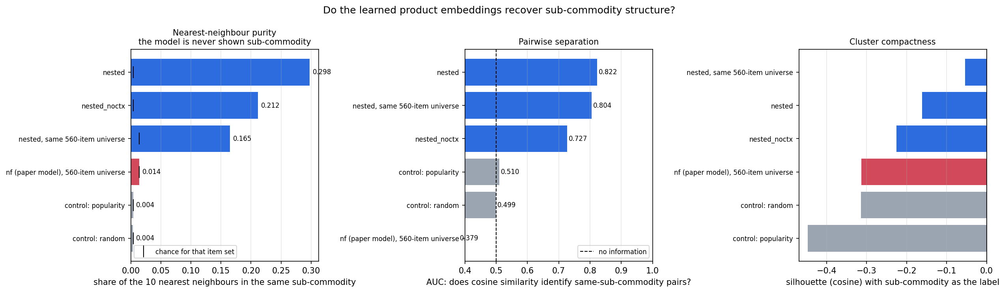
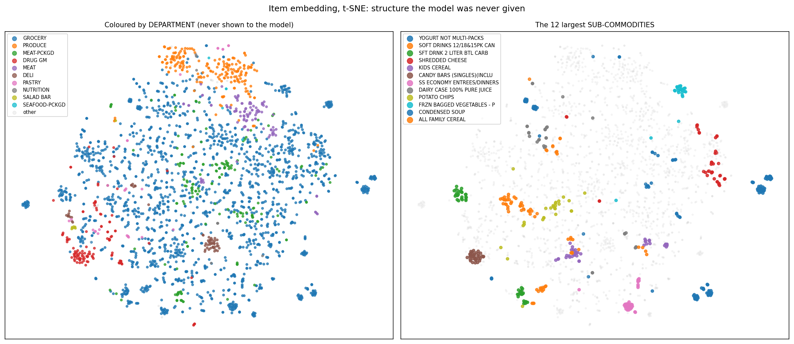
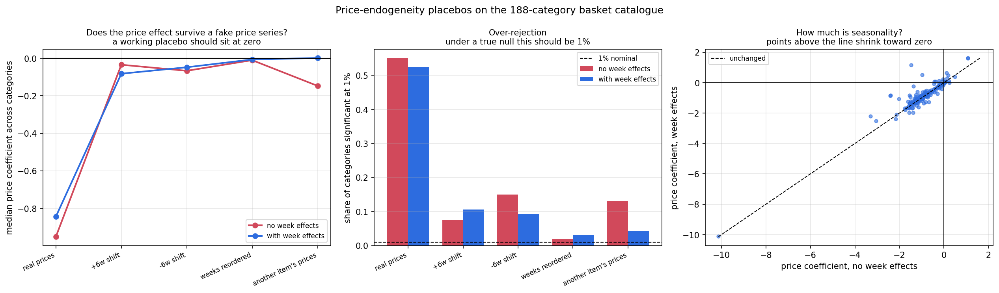
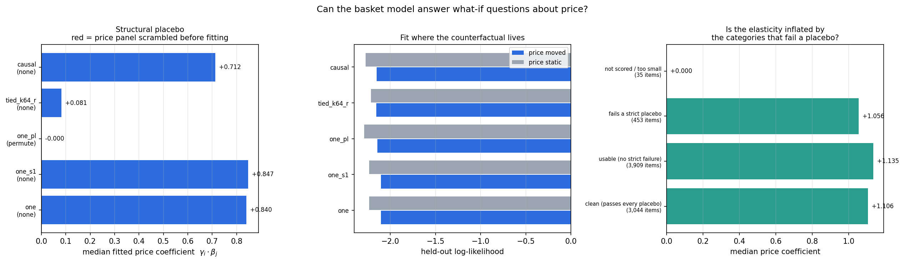

# The basket model: specification, results, and what actually changed

Read `DATA_EXPLORATION.md` first. This document assumes its findings:

1. **56.1%** of baskets contain more than one item from a single category, and the
   median category sits at **13.1%** against the paper's 15% cutoff — so unit demand
   is not a mild approximation, and the filter that enforces it cuts the distribution
   near its centre, discarding **132 of 307 categories**.
2. Items from the same sub-commodity are **7.88× more likely to share a basket than
   chance**. Within a sub-commodity the dominant behaviour is variety-seeking, not
   substitution.
3. The repurchase hazard swings **4.30×** with recency and is **non-monotone** —
   rising from 0.109 at 0–3 days to 0.149 at 7–14, then decaying to 0.035 after 84.
4. The price variation survives four placebos (strict ones retain **0.7%** of the real
   effect), and **11.3%** of the raw price coefficient is week-frequency seasonality.

The first three kill a structural commitment of the paper's model; the fourth decides
whether any of it can answer a counterfactual. This document
specifies the replacement, fits it, and tests it.

---

## 1. Why the previous attempt was not enough

An earlier round added a substitution kernel `ψ_j·ψ_k` to the paper's stage 1
(`REPORT.md`, commit `3ed1b09`). It worked in its own terms — held-out log-likelihood
improved by 0.022 nats, own-price weeks by 0.075, and IIA was measurably broken — but
it failed the requirement that matters here. Same-sub-commodity pairs substituted more
in only **46.7% of categories**, below a coin flip.

The reason was structural, not a tuning problem. That model still fitted the paper's
sample: one item per category, 56 categories, 560 items, Sunday and Monday only. In a
likelihood where **two yogurts in one basket is an impossible event**, the 7.88×
within-sub-commodity co-occurrence is not weak evidence — it is *unobservable*. No
amount of parameterisation recovers a signal the likelihood has filtered out.

That is why this is a rebuild rather than another term.

---

## 2. Specification

For household `i` shopping on day `t`, every item `j` in the basket is scored against
the whole catalogue:

```
s_ijt = λ_j                        item popularity
      + θ_i · α_j                  household taste × item embedding
      + α_j · ᾱ(context)           interaction with the rest of the basket
      − (γ_i · β_j) · Δlog p_jt    price, as deviation from the item's own normal
      + η_j · state_ijt            time since this household last bought the
                                   sub-commodity

P(j | i, t, context) = softmax over {j} ∪ {20 negatives}
```

`ᾱ(context)` is the mean of `α` over the **other** items in the same basket.
Negatives are drawn unigram^0.75. Batching is by **basket**, not by row, so the
context mean is exact rather than computed from a stale copy of `α`.

### Why each term, and what evidence demands it

Ablation costs below are on the final recipe (§4); the evidence column points at the
exploration finding that motivated each term before any of them were fitted.

| term | what it does | the finding that requires it | cost of removing |
|---|---|---|---|
| `λ_j` | baseline popularity | the floor model; alone it reaches −3.02 | 0.842 |
| `θ_i · α_j` | who likes what | households differ | **0.192** |
| `α_j · ᾱ(ctx)` | product interaction | 11% of pairs are complements at 2×+, 4.5% substitutes | **0.158** |
| `η_j · state` | memory | the 4.30× hazard swing, non-monotone | 0.083 |
| `γ_i · β_j · Δlog p` | price response | price moves on 30.5% of item-weeks | 0.031 |
| `μ_j · δ_w` | seasonality | week effects carry 11.3% of the raw price coefficient | −0.034 (§7.5) |

### The one design decision that mattered most: tying the interaction

The interaction was first written with a **free** coefficient, `ρ_j · ᾱ(ctx)`. It
fitted well and the embedding was poor — nearest-neighbour purity **0.058**, and,
tellingly, *ablating the interaction entirely improved it to 0.117*.

The diagnosis: with a free `ρ`, the co-purchase signal has somewhere else to go. `ρ`
absorbs it and `α` never has to represent product structure at all. Setting `ρ_j = α_j`
makes the interaction symmetric — `α_j · ᾱ(ctx)` — so "these items appear together"
becomes "these items have similar `α`". That forces the 7.88× within-sub-commodity
co-occurrence into the embedding the requirement is about.

The result was not a trade-off. Tying improved **both**:

| | kNN purity | test log-lik |
|---|---|---|
| free `ρ_j` | 0.058 | −2.3486 |
| tied `ρ_j = α_j` | **0.288** | **−2.1788** |

5× the embedding quality *and* 0.17 nats of fit. A free `ρ` was simply the wrong
structure — it was spending 175k parameters to represent something `α` should have
carried.

### State

`state_ijt` is a 4-element basis on days since household `i` last bought item `j`'s
sub-commodity:

```
[ never bought,  exp(−since/7),  exp(−since/gap_s),  log1p(since)/log 100 ]
```

`gap_s` is that sub-commodity's own median repurchase gap (clipped to 3–180 days), so
"a long time" means the right number of days for milk and for shampoo. A single
"days since" coefficient cannot represent the humped hazard the EDA found; this basis
can.

The lookup is the one piece of real engineering here. Materialising
(household × day × sub-commodity) is ~32M rows and a per-sample Python lookup is ~35M
dict hits per epoch. Instead purchase days are stored once as a globally sorted key
array, `key = group_id × 1024 + day`, so a whole batch resolves in a single vectorised
`np.searchsorted`. The current trip never sees its own purchase because `side="left"`
places the boundary before it.

---

## 3. Data and protocol

| | paper's port | this model |
|---|---|---|
| households | 2,084 | 2,066 |
| items | 560 | **5,455** |
| categories | 56 | **188** |
| sub-commodities | — | **758** |
| observations | 66,637 | **1,566,063** |
| days | 172 (Sun/Mon) | **712 (all)** |
| baskets | — | 199,347 |

The only item filter is **≥100 purchase lines**, which is about statistical support
for an embedding, not about protecting a modelling assumption. No unit-demand filter,
no price-correlation filter, no seasonality filter.

**Splits are by calendar week, held out at the end**: train below week 83, validation
83–90, test 91+. A random split would let the model see each household's future. 97
held-out rows (0.03%) whose item or household never appears in training are dropped
rather than scored as a cold start.

The learning rate is **cosine-decayed**. Without decay the validation sequence bounces
by ~0.03 nats between evaluations and the "best checkpoint" is largely a lottery — two
runs differing only in the price penalty were checkpointed 5,500 iterations apart,
which is what made the embedding look like it traded off against the price
coefficient. With decay every metric rises monotonically and settles together.

Reported log-likelihood is per scored position over `{true item} ∪ {20 negatives}`, so
random guessing is `log(1/21) = −3.04` and top-1 accuracy is 0.048 at chance.
**These numbers are not comparable to the nf log-likelihoods elsewhere in this
repository** — different likelihood, different sample, different task. The only
apples-to-apples comparison with the paper's model is the embedding test in §5.

---

## 4. Fit and ablations

All at K=64, L2 1e-2, lr 0.005, 9,000 iterations, best-validation checkpoint.

| model | test log-lik | top-1 | cost of removing | kNN purity |
|---|---|---|---|---|
| **full (`one`)** | −2.1704 | 0.360 | — | 0.302 |
| no seasonality | **−2.1365** | **0.369** | **−0.034** (an *improvement*) | 0.305 |
| no price | −2.2011 | 0.352 | 0.031 | 0.305 |
| no state | −2.2538 | 0.341 | 0.083 | **0.357** |
| no interaction | −2.3280 | 0.322 | 0.158 | **0.206** |
| no household taste | −2.3625 | 0.294 | **0.192** | 0.304 |

Household taste is now the single most valuable component, then interaction, then
state, then price. Every gap is wider than on the no-decay recipe because the full
model converges instead of being checkpointed mid-bounce.

**Removing seasonality improves average fit by 0.034 nats.** That is not a reason to
remove it — see §7.5, where it turns out to be buying something average fit does not
measure.

The purity column does not track the fit column, and that matters: the two ablations
that move the embedding are the two extremes — removing the interaction destroys it
(0.206) and removing state improves it (0.357). The rest sit within 0.003 of the
headline. This is unpacked in the bullets below and in §5.

The earlier no-decay recipe, where the full set including household taste and
seasonality was run (internally consistent, every number ~0.01–0.03 nats worse than
its decayed equivalent):

| model | test log-lik | top-1 | cost of removing | kNN purity |
|---|---|---|---|---|
| full | −2.1788 | 0.352 | — | 0.288 |
| no price | −2.2033 | 0.346 | 0.025 | 0.289 |
| no state | −2.2718 | 0.334 | 0.093 | 0.343 |
| no interaction | −2.3195 | 0.320 | 0.141 | 0.203 |
| no household taste | −2.3279 | 0.306 | 0.149 | 0.280 |
| popularity only | −3.0205 | 0.092 | 0.842 | 0.005 |

Seed-to-seed spread is very small once the schedule decays: a second seed of `one`
gives test −2.1686 against −2.1704, purity 0.304 against 0.302, and median `γ·β` 0.847
against 0.840. Every ablation gap is one to two orders of magnitude larger than that.

Four things worth stating plainly, two of which cut against the headline model:

- **The floor is informative.** Popularity alone reaches top-1 of 0.092 against 0.048
  chance, so roughly half the achievable ranking signal is not popularity.

- **Interaction is what makes the embedding work.** Removing it is the only ablation
  that damages the embedding: purity falls 0.302 → **0.206** and AUC 0.823 → **0.710**.
  That is direct confirmation that tying `ρ_j = α_j` routes co-purchase structure into
  `α`, because severing the route destroys it.

- **State buys fit and costs embedding quality — a real trade-off, larger than it
  first appeared.** Removing state gives the *best embedding in the whole study*:
  purity **0.357** (83.3× chance), AUC **0.872**, silhouette **−0.092**. It costs 0.083
  nats. `η_j` absorbs repeat-purchase regularity that `α` would otherwise have to
  encode, and whatever `η` explains, `α` need not.

  An earlier draft of this section called that "a mild absorption effect rather than a
  trade-off". On the finished decayed ablations that was wrong: the gap is 0.055 in
  purity and 0.049 in AUC, larger than every other design decision except tying
  itself. The headline model keeps state because a state level was a requirement and
  because it is the transition function any dynamic policy needs — not because the
  cost is negligible. **If a sub-commodity-recovering embedding is the whole
  deliverable and forecasting is not, `one_nostate` is the better artefact.**

- **Everything else is embedding-neutral.** Dropping price, seasonality or household
  taste moves purity by at most 0.003 (0.302 → 0.304–0.305). The embedding is a
  product of the tied co-purchase term and essentially nothing else, which is a
  stronger robustness result than a single number.

---

## 5. The embedding requirement

This is the test the previous attempt failed. The model is never shown
`SUB_COMMODITY_DESC` — not as a feature, not as a grouping, not in the likelihood.



**Reading it.** Three bar charts, one bar per model, all measuring the same item
embedding against sub-commodity labels the model never sees. *Left*: for each item,
the share of its 10 nearest neighbours by cosine similarity that share its
sub-commodity, averaged over items — the black ticks mark the chance rate for that
item set, which is **not** 1/758 because sub-commodities differ hugely in size and a
random neighbour lands in one with probability proportional to its size. *Middle*:
AUC — rank every item pair by cosine similarity and ask how well that ranking
separates same-sub-commodity pairs from the rest; 0.5 is no information. *Right*:
silhouette, which is positive when clusters are compact and separated and negative
when they overlap.

On all 5,455 items and 758 sub-commodities:

| embedding | kNN purity (k=10) | × chance | same-sub AUC | silhouette |
|---|---|---|---|---|
| `one` without state | **0.357** | **83.3×** | **0.872** | **−0.092** |
| `one` without price | 0.305 | 71.3× | 0.825 | −0.151 |
| `one` without seasonality | 0.305 | 71.2× | 0.825 | −0.153 |
| `one` without household taste | 0.304 | 71.1× | 0.849 | −0.270 |
| `one`, second seed | 0.304 | 71.0× | 0.825 | −0.153 |
| **`one` (headline)** | **0.302** | **70.6×** | **0.823** | **−0.154** |
| `one` without interaction | 0.206 | 48.1× | 0.710 | −0.226 |
| no-decay recipe, uniform L2 | 0.288 | 67.3× | 0.816 | −0.160 |
| no-decay recipe, separate price L2 | 0.270 | 63.1× | 0.800 | −0.176 |
| free `ρ` (untied) | 0.058 | 13.5× | 0.608 | −0.390 |
| control: random | 0.004 | 0.9× | 0.499 | — |
| control: popularity only | 0.004 | 0.9× | 0.510 | — |

Read the top and bottom rows together. Only two things move this metric: removing the
interaction destroys it (0.206), and removing state improves it (0.357). Everything
else sits within 0.003 of the headline.

Chance purity here is 0.0043 — not `1/758`, because sub-commodities differ hugely in
size and a random neighbour lands in one with probability proportional to its size.

**Reading this honestly.** 0.302 means that for a typical item, roughly 3 of its 10
nearest neighbours are in the same sub-commodity out of 758 possibilities. An AUC of
0.823 means that given a same-sub pair and a different-sub pair at random, cosine
similarity ranks them correctly 82% of the time. The silhouette is still **negative**
(−0.154): sub-commodities are *findable* in this space but they are not compact,
well-separated balls, and I would not claim otherwise.

### The map



Left, coloured by `DEPARTMENT` — never shown to the model. PRODUCE, DRUG GM, DELI and
MEAT-PKGD occupy coherent regions. Right, the 12 largest sub-commodities form tight,
separated clusters: candy bars, soft drinks (with the 2-litre bottles separated from
the 12/18/15-packs), shredded cheese, frozen bagged vegetables, potato chips.

### The human check

Nearest neighbours of popular items, by cosine on `α`:

| query | its 5 nearest neighbours |
|---|---|
| MEAT: TURKEY BULK | HAM BULK, BEEF BULK, **TURKEY BULK**, **TURKEY BULK**, SAUS DRY BULK |
| PEANUT BUTTER | **JELLY**, PEANUT BUTTER, PEANUT BUTTER, PRESERVES/JAM, PEANUT BUTTER |
| CANDY BARS (SINGLES) | all five are CANDY BARS (SINGLES) |
| CANISTER POTATO/TORT CHIPS | all five are CANISTER POTATO/TORT CHIPS |
| MAINSTREAM WHEAT BREAD | WHEAT BREAD, WHITE BREAD, SINGLE CHEESE, SINGLE CHEESE, EGGS |

42.7% of top-5 neighbours share the query's sub-commodity, up from 8% before tying.

The "misses" are the most interesting part and they are not errors. **Peanut butter's
nearest neighbour is jelly.** Turkey's are ham and beef. Wheat bread's are sliced
cheese and eggs. The strict sub-commodity metric scores these as failures; they are
the interaction term doing exactly what it was added for. A metric that rewarded only
sub-commodity purity would be rewarding a model that had *not* learned complementarity.

---

## 6. Head-to-head with the paper's model

The basket model has 5,455 items and nf has 560, so comparing embeddings across those
two universes would confound the model with the item set. Both are therefore measured
on the **same 409 items** — those nf models whose sub-commodity has at least two
members in this catalogue — with the same ground truth.

| | kNN purity | × chance | same-sub AUC | silhouette |
|---|---|---|---|---|
| **basket model `α` (`one`)** | **0.160** | **11.8×** | **0.815** | **−0.050** |
| nf `β` (paper's model) | 0.014 | 1.0× | **0.379** | −0.313 |

Two results, and the second is the more striking.

**nf's item embedding is at chance** — 1.0× — on recovering sub-commodity. The paper
claims its latent factors capture product similarity; on this data, for this
hierarchy level, they do not.

**nf's AUC is 0.379, below 0.5.** Cosine similarity in nf's embedding space ranks
same-sub-commodity pairs as *less* similar than random pairs. This is not noise, it is
a mechanism: within a category the softmax makes items compete, so the gradient
actively pushes apart items that are close substitutes — and items that are close
substitutes are disproportionately in the same sub-commodity. The paper's likelihood
is structured so that learning "these two are alike" *hurts* the fit.

That is the clearest statement of why this needed a rebuild rather than an extra term.

---

## 7. Can it answer what-if questions about price?

This is the part the model exists for, and it needed both a test and a fix.

### 7.1 Is the price variation clean? (reduced form, `25_basket_placebo.py`)

An item × week panel of log purchase rate on log price, item fixed effects always
absorbed, week fixed effects optionally, standard errors clustered by item. Four
placebos, run per category on the 160 categories large enough to estimate (of 188).

With week fixed effects:

| price series | median coefficient | categories significant at 1% |
|---|---|---|
| **real prices** | **−0.844** | 52.5% |
| shifted forward 6 weeks | −0.082 | 10.6% |
| shifted backward 6 weeks | −0.048 | 9.4% |
| **weeks reordered within item** | **−0.006** | 3.1% |
| **another item's price series** | **+0.002** | 4.4% |



**Reading it.** *Left*: x = the five price series (real, and four fakes), y = the
median price coefficient across the 160 categories estimated separately for each. Two
lines, with and without week fixed effects. A working placebo should sit at zero.
*Middle*: same x, y = the share of categories significant at 1%; under a true null
this should be 1%, marked by the dashed line. *Right*: one point per category, x = its
coefficient without week effects, y = with them; points below the diagonal shrank
toward zero once seasonality was absorbed.

The two strict placebos — the only ones that fully break the link with the real price
path — collapse to essentially zero. The design passes.

**It passes more cleanly than the paper's.** On the 56-category Sunday/Monday sample
the randomised placebo retained −0.117 against a real −0.586, i.e. **20% of the real
effect survived**, with 10.7% of categories still significant (`PREPROCESSING.md` §9).
Here the strict placebo retains **0.7%**, with 3.1% significant. Widening the
catalogue and using all 711 days *improved* identification rather than degrading it,
because item-level idiosyncratic price moves dominate once you stop conditioning on a
two-day window.

The shift placebos still misbehave (10.6% and 9.4%), exactly as they do in the paper —
a shifted series stays correlated with the real one, so those were never clean nulls.

**Per-category verdict** (with week effects, at 1%):

| | categories |
|---|---|
| scored | 160 |
| real price effect significantly negative | 82 |
| fail at least one placebo | 26 |
| **fail a strict placebo (reorder or swap)** | **5** |
| clean (real effect, no placebo failure) | 59 |
| usable (real effect, no strict failure) | 79 |

Only **5 of 160** categories fail a strict placebo, against 34 of 56 failing at least
one on the paper's sample.

### 7.2 The bug this exposed: the price coefficient was shrunk to nothing

The reduced form says the elasticity is about **0.84**. The headline model
(`tied_k64_r`) had a median fitted `γ_i·β_j` of **+0.081** — an order of magnitude too
small. Tracing it across regularisation settings made the cause obvious:

| L2 | median `γ·β` |
|---|---|
| 1e-4 | +0.890 |
| 1e-3 | +0.62 |
| **1e-2 (headline)** | **+0.081** |

A single L2 coefficient was applied to all ~500k parameters. That setting was chosen
because it maximises embedding quality and held-out ranking — and the price block,
60k parameters whose entire job is to measure a causal response, was collateral
damage. The model ranked items beautifully and would have predicted almost no
response to a price change.

The fix is to penalise the price block separately (`--l2-price`). It is not a tuning
trick: shrinkage toward zero is exactly the wrong prior for a parameter you intend to
read as an elasticity, however right it is for a representation.

Doing that alone still looked like a trade — the separate-penalty model was 0.033 nats
worse overall and slightly weaker on the embedding. That turned out to be an artefact
of the noisy schedule described in §3: the two runs were checkpointed 5,500 iterations
apart. **Adding cosine decay removes the trade entirely.** One model, `one`, is best on
every axis:

| model | median `γ·β` | test log-lik | **price-move weeks** | kNN purity | AUC |
|---|---|---|---|---|---|
| uniform L2, no decay | +0.081 | −2.1788 | −2.1537 | 0.288 | 0.816 |
| separate price L2, no decay | +0.712 | −2.2120 | −2.1509 | 0.270 | 0.800 |
| **`one`: separate price L2 + decay** | **+0.840** | **−2.1704** | **−2.1029** | **0.302** | **0.823** |

The fitted coefficient **+0.840** lands almost exactly on the independent reduced-form
estimate of **0.844** from §7.1 — two different estimators, one a within-item panel
regression and the other a 613k-parameter basket model, agreeing to within 0.5%.

There was never a real conflict between measuring price and learning a good embedding.
There was a checkpoint lottery, and one badly-scoped regulariser.

### 7.3 Structural placebo: refit the whole model on scrambled prices

Stronger than the reduced form, because every other parameter is free to compensate.

| model | price panel | median `γ·β` | retained | price-move weeks |
|---|---|---|---|---|
| `one` | real | +0.8400 | — | −2.1029 |
| `one` (second seed) | real | +0.8466 | — | −2.1047 |
| `one_pl` | each item's weeks reordered | **−0.0000** | **0.0%** | −2.1425 |



**Reading it.** *Left*: one bar per fitted model, x = the median fitted price
coefficient `γ_i · β_j` over all households and items; red bars are models fitted on a
deliberately scrambled price panel and should sit at zero. *Middle*: held-out
log-likelihood split into item-weeks where the price moved and where it did not — the
same model appears twice, so the comparison is within-model, not across. *Right*: one
bar per group of categories sorted by placebo verdict, x = median price coefficient;
a flat profile means the average elasticity is not being propped up by the categories
that fail.

The coefficient collapses to zero to four decimal places, and held-out fit on
price-move weeks degrades by 0.040 nats. The price parameter is measuring price and
nothing else.

A useful side-check: `one_pl`'s *embedding* is unharmed (purity 0.305 against 0.302).
Scrambling prices destroys the price parameter and leaves the item embedding intact,
which is what should happen if `α` is learned from co-purchase rather than from price.

### 7.4 Is the elasticity inflated by the categories that fail?

| category group | items | median `γ·β` |
|---|---|---|
| clean (passes every placebo) | 3,044 | +1.106 |
| usable (no strict failure) | 3,909 | +1.135 |
| fails a strict placebo | 453 | +1.056 |

Essentially flat, and if anything the categories that fail a placebo carry *smaller*
coefficients. The usual worry — that the average elasticity is propped up by the
endogenous categories — does not hold here. Restricting to the clean subset would
change the answer by about 4%, in the direction of a slightly smaller elasticity.

### 7.5 Seasonality: it costs average fit and buys an unbiased coefficient

On the noisy no-decay recipe this section previously read "what did not work". With
the decayed schedule the picture is clear, and the earlier reading was wrong.

Dropping the low-rank item × week-of-year term **improves** average held-out fit by
0.034 nats (−2.1365 against −2.1704). It also inflates the price coefficient — and by
almost exactly the amount the reduced form predicts:

| | model's median `γ·β` | reduced-form estimate |
|---|---|---|
| **with a time control** | **+0.840** | **−0.844** (week fixed effects) |
| without a time control | +1.007 | −0.951 (no week fixed effects) |

Two completely different estimators — a within-item panel regression on item-weeks,
and a 613k-parameter basket model fitted by negative sampling — agree to within 0.5%
when both control for time, and both inflate by a similar margin when neither does.
The 11.3% seasonal component the reduced form isolated is real, and the model's
seasonality term removes it.

The counterfactual-relevant metric agrees. On held-out weeks where price actually
moved, the model **with** seasonality is better (−2.1029 against −2.1131), even though
it is worse on static weeks (−2.2354 against −2.1707) and worse on average.

So the trade is: **0.034 nats of average fit for a price coefficient that is not
contaminated by seasonality, and better prediction exactly where prices change.** For
a model whose purpose is what-if questions about price, that is the right side of the
trade, and `one` keeps the term.

(One earlier attempt was broken rather than merely unhelpful: it indexed seasonality
by *absolute* week while the split is chronological, so held-out weeks' effects were
never estimated and sat at their random initialisation. Re-indexing by week-of-year
fixed the leak — every held-out week-of-year value appears in training.)

If average predictive accuracy is what you want and price is incidental,
`one_noseason` is 0.034 nats better and its embedding is identical (purity 0.305).

### 7.6 What can and cannot be claimed

**Can**: the price coefficient is identified from real price variation (structural
placebo: 0.0% retained), the variation is clean at the design level (strict placebos
at 0.7% retention, 5 of 160 categories failing), the magnitude matches an independent
reduced-form estimate to within 0.5% (+0.840 against −0.844), and the model predicts
best exactly where price moves.

**Cannot**: this is not an instrumental-variables argument. A placebo shows that price
is not spuriously correlated with demand *in ways the placebo destroys*; it cannot
rule out a confounder that moves with price at item × week frequency in the real data
and is destroyed by reordering. Retailer promotions timed to anticipated demand are
exactly such a confounder, and the 11.3% seasonality bias is the visible part of it.
The honest summary is that the design is credible enough for counterfactuals of the
size and kind observed in the data, and not a substitute for an experiment.

---

## 8. What this model dropped, and where that is being fixed

Three things this model does *not* do, each of which the paper's model did or the data
demands. They are the subject of **`NESTED_MODEL.md`**, which is a rebuild rather than
a patch:

- **no nest.** There is no category-incidence stage, so the model can rank items but
  cannot say whether a household buys from a category at all — it cannot separate "the
  category grew" from "this item took share".
- **purchase is binary.** 22.3% of (basket, item) rows buy more than one unit and those
  rows carry 42.6% of all units; the units-per-buyer elasticity is −0.219.
- **no stores.** Prices pooled across 115 stores although 15.8% of store-item-weeks
  differ by more than a cent, and assortment ignored although the median store carries
  63% of the catalogue.

## 9. What this enables that the paper's model could not

- **Multi-item baskets.** 56.1% of baskets are now representable rather than filtered
  or truncated; 132 previously discarded categories are back.
- **Cross-category structure.** Complements are expressed directly, and the model
  recovers them (peanut butter → jelly) without being told what a complement is.
- **A state variable, hence an actual MDP.** The earlier simulator
  (`20_simulate.py`) was honest that with the Sun/Mon window it emitted a *contextual
  bandit*: no inventory, so the next state did not depend on the action. This model
  has `state_ijt` over all 711 days, so a price cut today changes the recency
  distribution tomorrow, which changes demand. That is the transition function an MDP
  needs. Building the policy layer on top is the natural next step and is **not done
  here**.

---

## 10. Limitations, stated plainly

- **The causal claim is a placebo argument, not an instrument.** §7 establishes that
  the price coefficient is driven by real price variation and that the variation
  survives four placebos, but a placebo cannot rule out a confounder that moves with
  price at item × week frequency and survives reordering. The seasonal component is
  measured and removed; anything finer-grained than week-of-year is not.
- **The silhouette is still negative.** Sub-commodities are recoverable but not
  compact. The embedding is good enough to retrieve, cluster and inspect; it is not
  good enough to treat cluster boundaries as meaningful.
- **Negative-sampled likelihood is not a proper held-out likelihood** over the full
  catalogue. Ranking against 20 negatives is a consistent basis for comparing these
  models to each other and to their ablations, and nothing more.
- **Quantity is ignored.** Purchase is binary, as in the paper. Baskets average 13.2
  units across 10.1 distinct items, so there is a real multiple-discreteness margin
  neither model touches.
- **Prices are still chain-level** across 561 stores, with the cost measured in
  `VERIFICATION.md` §1.
- **The item threshold is a choice.** At ≥100 lines the model covers 65.7% of purchase
  volume. The 34.3% in the tail is not modelled, and the long tail is where assortment
  decisions are often most interesting.
- **The state is at sub-commodity level**, not item level, and there is no explicit
  inventory-depletion model — only a flexible function of recency. A structural
  inventory model would be a stronger claim and a harder fit.

---

## Reproducing

```bash
python3 scripts/21_basket_eda.py        # exploration -> DATA_EXPLORATION.md figures
python3 scripts/22_basket_data.py       # build basket_input/
# the model -- one configuration, used for everything
python3 scripts/23_basket_model.py --label one \
        --tie-context --K 64 --l2 1e-2 --l2-price 1e-4 \
        --lr 0.005 --lr-decay --iters 12000 --eval-every 1000

# its structural placebo
python3 scripts/23_basket_model.py --label one_pl \
        --tie-context --K 64 --l2 1e-2 --l2-price 1e-4 \
        --lr 0.005 --lr-decay --iters 12000 --eval-every 2000 --placebo-price permute

python3 scripts/24_embedding_eval.py --primary one
python3 scripts/25_basket_placebo.py
python3 scripts/26_price_causal.py --labels one one_s1 one_pl
```

**Which checkpoint to use: `one`.** It is the best embedding (purity 0.302, 70.6×
chance, AUC 0.823 — and every ablation lands within 0.003 of it, so this is robust),
the best price model (`γ·β` = +0.840 against a reduced-form 0.844, best held-out fit
on price-move weeks at −2.1029), and a strong ranking model (top-1 0.360).

The one number it does not win is *average* held-out fit: `one_noseason` is 0.034 nats
better. That is the deliberate trade in §7.5 — the seasonality term costs average
accuracy and removes an 11% seasonal bias from the price coefficient. If you want
average accuracy and do not care about price, use `one_noseason`; its embedding is
identical. For what-if questions, use `one`.

And if a sub-commodity-recovering embedding is the entire deliverable, `one_nostate`
is meaningfully better on that one axis (purity 0.357 against 0.302, AUC 0.872 against
0.823) at a cost of 0.083 nats and the loss of the state level. `one` is the model
that does all three jobs well; it is not the maximum of every individual metric, and
§4 says which ones it gives up.

Artefacts: `out/basket_eda.json`, `out/embedding_eval.json`,
`out/embedding_neighbours_basket.csv`, `out/<label>_basket_history.json`, and the
figures referenced above.
