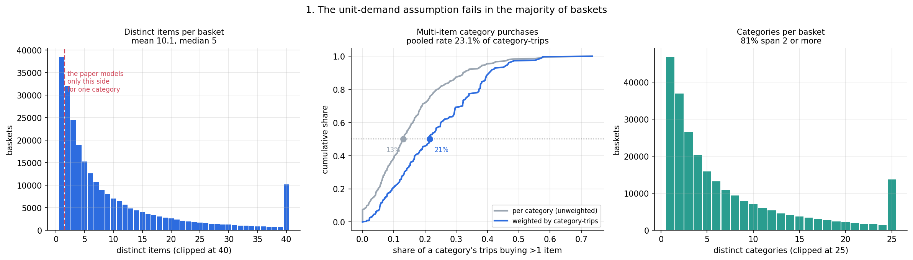
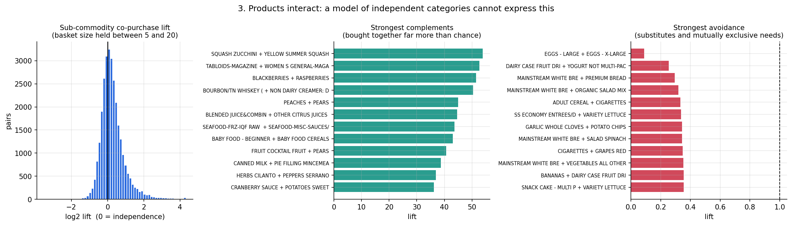
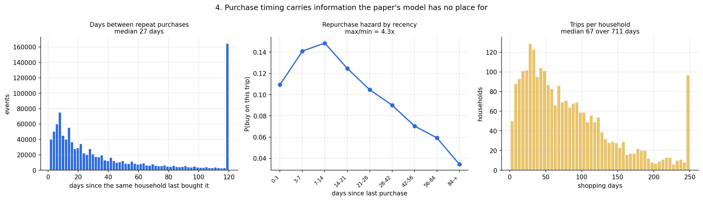
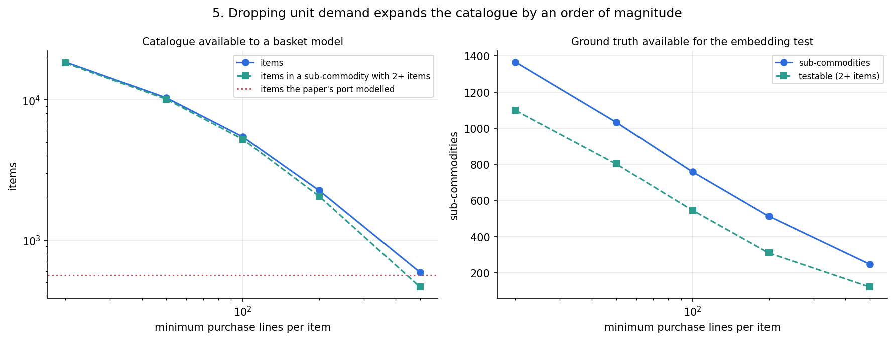
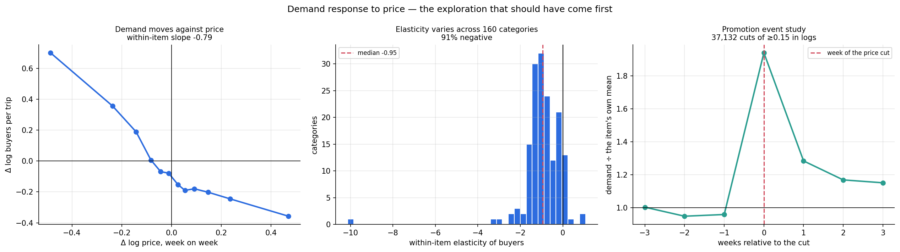
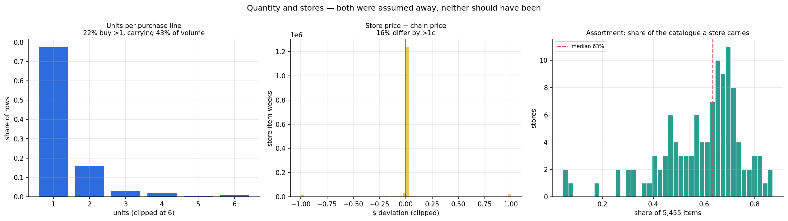
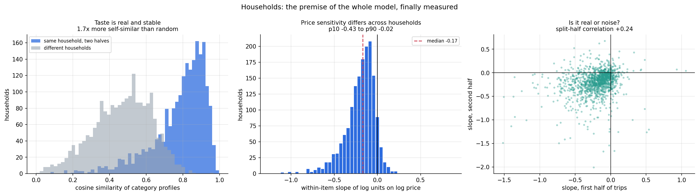
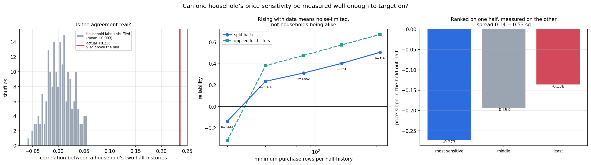
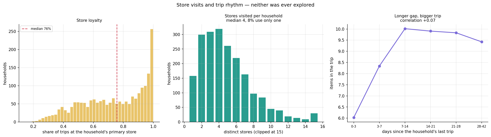

# Data exploration: dunnhumby "The Complete Journey"

**Source.** `transaction_data.csv`: 2,553,406 purchase lines, 2,500 households, 91,856
products, 253,183 baskets, 711 days, 307 commodities, 2,373 sub-commodities. Prices
are reconstructed from `SALES_VALUE` and the three discount columns; that
reconstruction is audited separately and is not repeated here.

Where a figure is quoted for a filtered catalogue rather than the raw file, the filter
is stated. The working catalogue used from §4 onward is the 5,455 items with at least
100 purchase lines — 65.7% of volume — which is the level at which per-item quantities
are estimable.

**Scripts.** §§1–5 `21_basket_eda.py`, §6 `29_demand_eda.py`, §7 `30_household_eda.py`,
§8 `25_basket_placebo.py`. Every number and figure comes from one of them; none is
typed by hand.

<!-- **Figures.** Every figure carries a **Reading it** note giving what each axis is and
what one observation represents — per item, per category, per household, per pair —
along with any transform applied: logs, clipping, binning, normalisation. Several
panels are not raw data (binned scatters, survival curves over a threshold, cumulative
distributions, split-half constructions), and in those cases the construction is the
thing that has to be understood before the shape means anything.

**Derived numbers.** Anything that is not a raw count — lift, elasticity, hazard,
cosine similarity, breadth — is given with the **arithmetic that produced it**, and
where it helps, a worked example on real rows. A term like "lift" or "elasticity"
means several different things depending on what was conditioned on and what the
reference is, so the formula is stated rather than the name. -->

### What is measured here

| question | section |
|---|---|
| how many items does a basket hold, and how many from one category? | §1 |
| which products get bought together, and which never are? | §2 |
| how long between repeat purchases, and does that predict the next one? | §3 |
| how many products have enough purchases to analyse? | §4 |
| how much do prices move? | §5 |
| **does demand respond to price, and through which margin?** | **§6** |
| **do households differ — in taste, in price response, in where they shop?** | **§7** |
| **is the price variation exogenous?** | **§8** |

## 1. What a basket contains



A basket is not one item, and it is often not one item per category either.

| measurement | value |
|---|---|
| baskets containing **more than one item from a single category** | **56.1%** |
| baskets spanning 2 or more categories | 81.5% |
| baskets spanning 5 or more categories | 48.4% |
| mean distinct items per basket | 10.1 |
| median distinct items per basket | 5 |
| categories where >15% of category-trips buy 2+ items | **132 of 307** |
| median category's multi-item share | 13.1% |

**Reading the middle panel.** It starts from a table with **one row per category** —
307 rows, two columns:

| category | category-trips | rate of buying 2+ items |
|---|---|---|
| EGGS | 27,600 | 0.022 |
| FLUID MILK PRODUCTS | 67,700 | 0.215 |
| SOFT DRINKS | 68,000 | 0.415 |
| … | | |

Sort those 307 rows by the last column and walk along it. That is the x-axis: **a
category's own rate of buying more than one item**. Both curves are cumulative — y is
the share *at or below* x — so both rise from 0 to 1 by construction.

The two curves count the same 307 rows differently, and that is the whole point:

- **Grey — each category counts once.** y = "what fraction of *categories* have a rate
  at or below x". At x = 0.13 it reads 0.50, so half of all categories buy multiple
  items on 13% or fewer of their trips.
- **Blue — each category counts by how many category-trips it gets.** y = "what
  fraction of *category-trips* happen in a category with a rate at or below x". At
  x = 0.13 it reads only 0.28.

The gap between them says the rate is **higher in the categories shoppers visit
most**. EGGS and SOFT DRINKS both count once in grey, but SOFT DRINKS is met 2.5×
more often, and it buys multiple items 19× as readily.

Reading the medians off the 50% line: **half of categories sit below 13.1%, but half
of category-trips happen in categories above 21.5%.** The pooled rate over all
category-trips is **23.1%** — which is the number that describes a shopper's
experience, and nearly double the per-category median.

| category | category-trips | buys 2+ items |
|---|---|---|
| SOFT DRINKS | 68,000 | **41.5%** |
| BAG SNACKS | 41,100 | **39.5%** |
| CHEESE | 46,100 | **37.8%** |
| BAKED BREAD/BUNS/ROLLS | 59,300 | 29.6% |
| BEEF | 36,200 | 25.0% |
| FLUID MILK PRODUCTS | 67,700 | 21.5% |
| TROPICAL FRUIT | 32,200 | 5.5% |
| EGGS | 27,600 | 2.2% |

Drinks, snacks, cheese and bread are bought several at a time; eggs and tropical fruit
essentially never are.

At the basket level this compounds: **56.1%** of baskets contain at least one category
bought two or more times.

---

## 2. Which products are bought together



**What "lift" is here, exactly.** Not a definition — the actual computation, so the
numbers below can be checked.

Everything is counted inside one **stratum**: baskets holding between 5 and 20
distinct sub-commodities, after items with fewer than 100 purchase lines are dropped.
That leaves **n = 83,928 baskets**. Every count below is a count of baskets in that
set, and a basket either contains a sub-commodity or does not — buying three yogurts
counts once, so this measures co-*occurrence*, not co-volume.

For a pair of sub-commodities `x` and `y`:

```
solo[x]  = baskets containing x                        (out of n)
solo[y]  = baskets containing y
k        = baskets containing BOTH x and y

observed = k / n
expected = (solo[x] / n) × (solo[y] / n)      if x and y were independent
lift     = observed / expected
```

**Worked example — the highest-lift pair in the data:**

| | value |
|---|---|
| x = SQUASH ZUCCHINI | in **700** of the 83,928 baskets |
| y = YELLOW SUMMER SQUASH | in **236** |
| both together | **k = 106** |

```
observed = 106 / 83,928                     = 0.001263
expected = (700/83,928) × (236/83,928)      = 0.0000235
lift     = 0.001263 / 0.0000235             = 53.85
```

So courgettes and yellow squash land in the same basket **54 times more often than
they would if the two were unrelated**. That is the far right edge of the left panel.

**Two filters, and what each is for:**

- **The 5–20 stratum.** A household buying 30 sub-commodities co-buys everything, so
  without this, lift would largely measure basket size. Restricting to a band of
  comparable baskets removes that. The cost is that a pair's lift here is *not* what
  you would get on all 253,183 baskets — every number in this section lives inside
  the stratum.
- **Pairs need k ≥ 30.** A pair seen 3 times together can show a lift of 40 by
  accident. This leaves **29,117 pairs** of the ~287,000 possible.

**Reading the panels.** *Left*: one observation per pair, x = `log2(lift)`, y = how
many pairs. Logs because lift is a ratio — "twice as often" (2) and "half as often"
(0.5) are equally far from independence, but on a raw scale 2 sits 1.0 above 1 and 0.5
only 0.5 below it, which would squash the left half of the distribution. On the log
scale **0 is independence**, +1 is twice chance, −1 is half. Clipped to lift ∈
[0.05, 20] so the 53.85 example above does not stretch the axis.

*Middle and right*: the 12 pairs with the highest and lowest lift, one bar each, x =
lift on a plain linear scale — these are read as individual values, not as a
distribution, so no log is needed.

On **83,928 baskets** and **29,117 sub-commodity pairs**:

| | value |
|---|---|
| median lift | 1.13 |
| pairs with lift > 1.5 | 23.6% |
| pairs with lift > 2.0 | **11.0%** |
| pairs with lift < 0.67 (mutual avoidance) | 4.5% |
| 99th percentile lift | 6.47 |

So most pairs sit near independence, with a structured tail at both ends: roughly one
pair in nine is a genuine complement at twice chance or better, and one in twenty is
avoided. The bulk is unstructured; the tails are not.

### Within a sub-commodity, shoppers seek variety

Items from the **same sub-commodity** are

> **7.88× more likely to appear in the same basket than chance**

Computed differently from the pair lifts above, so here is that arithmetic too. Take
every basket with 2–30 distinct items and enumerate every **item pair** inside it.
Each pair either shares a sub-commodity or does not:

```
observed = same-sub pairs / all within-basket pairs        = 0.0323
```

For the reference, ask what that share would be if items were drawn at random from the
catalogue. With `c_s` items in sub-commodity `s` and `T` items in total:

```
expected = Σ_s c_s(c_s − 1) / (T(T − 1))                   = 0.0041
ratio    = 0.0323 / 0.0041                                 = 7.88
```

The expected value is small because most sub-commodities hold only a handful of the
5,455 items, so two randomly chosen items rarely share one.

This is the opposite of what a pure substitution story predicts. If items within a
sub-commodity were substitutes, buying one would make buying another *less* likely and
the ratio would be below 1.

Shoppers do not pick one yogurt. They pick three — different flavours, same
sub-commodity. They buy two apple varieties. **Within a sub-commodity the dominant
behaviour is variety-seeking, not substitution.** Substitution shows up between
sub-commodities, not inside them.

---

## 3. Repurchase timing



**Reading it.** *Left*: one observation per repeat-purchase **event** — every time a
household bought a sub-commodity it had bought before. x = days since that household's
previous purchase of it, y = how many events. Clipped at 120 days.

*Middle* is the one that needs care, because it is not a distribution of anything. The
unit is a **(household, trip, sub-commodity) opportunity**: for every trip a household
made, and every sub-commodity it has ever bought, ask "how long since they last bought
this, and did they buy it now?". Group those opportunities by days-since and take the
share that ended in a purchase. So y is a **conditional probability**, not a count, and
the x bins have unequal widths (0–3, 3–7, 7–14, …) so the axis is categorical rather
than linear — the visual spacing is not proportional to elapsed time. The current trip
is excluded from its own history; without that, every point would read 100%.

*Right*: one observation per household, x = how many distinct days it shopped, y = how
many households.

Across **1,082,615 repeat-purchase events**:

- median gap between repeat purchases of a sub-commodity: **27 days** (p25 10, p75 71)

The decisive measurement is the **repurchase hazard**: the probability of buying a
sub-commodity on this trip, as a function of days since that household last bought it.
Measured on the 60 most widely bought sub-commodities, with the current trip excluded
from its own history:

**How the hazard is computed.** The question is: *given that a household is in the
store today, how likely are they to buy milk — and does that depend on how long it has
been since they last bought milk?*

Answering it needs one row per **opportunity**, not per purchase. An opportunity is a
household walking into a store on a day when it *could* have bought the
sub-commodity. Most opportunities end in no purchase, and those rows are the whole
point — a hazard is purchases ÷ opportunities, so leaving out the misses would make
every value 1.

Here is one real household's trips, for FLUID MILK WHITE ONLY. Every row is a
shopping trip; `bought?` says whether milk was in that basket:

| DAY | bought? | buy_day | ffilled | prev_buy | since |
|---|---|---|---|---|---|
| 42 | yes | 42 | 42 | — | — |
| 49 | yes | 49 | 49 | 42 | **7** |
| 53 | yes | 53 | 53 | 49 | **4** |
| 54 | yes | 54 | 54 | 53 | **1** |
| 58 | yes | 58 | 58 | 54 | **4** |
| 63 | yes | 63 | 63 | 58 | **5** |
| 64 | no | — | 63 | 63 | **1** |
| 66 | no | — | 63 | 63 | **3** |
| 69 | yes | 69 | 69 | 63 | **6** |
| 73 | no | — | 69 | 69 | **4** |
| 82 | no | — | 69 | 69 | **13** |
| 86 | yes | 86 | 86 | 69 | **17** |

Read the four derived columns left to right:

1. **`buy_day`** — the day, but only on rows where milk was actually bought. Blank
   otherwise.
2. **`ffilled`** — forward-fill that column: carry the last non-blank value downward.
   Now every row knows the most recent milk purchase *including today's*. On day 64
   it reads 63, which is right — the last purchase was day 63.
3. **`prev_buy`** — shift `ffilled` down by one row. **This is the step the original
   text failed to explain.** Without it, day 63 would say its last purchase was day
   63 — itself. Every buying row would report 0 days since, and every buying row is
   by definition a purchase, so the 0-day bin would be 100% purchases. The shift
   makes each row look at the state of the world *as it was on arrival*, before
   today's basket existed.
4. **`since`** = `DAY − prev_buy`. Day 49 is 7 days after the day-42 purchase; day 82
   is 13 days after the day-69 one.

The first row has no `prev_buy` and is dropped — there is no prior purchase to measure
from.

Now pool these rows across all buyer households and the 60 most widely bought
sub-commodities, group by `since`, and within each group take the share that bought:

```
hazard(bin) = rows in bin with bought? = yes / all rows in bin
```

From the twelve rows above, the 1-day bin holds day 54 (bought) and day 64 (not), so
it contributes 1 purchase out of 2 opportunities. The 13-day bin holds day 82 alone,
contributing 0 out of 1. Millions of such rows give the curve below.

Two consequences worth being explicit about. Only households that **ever** buy the
sub-commodity are included, so the curve is about repurchase timing among buyers, not
about the population at large. And the bins have unequal widths (0–3, 3–7, 7–14, …),
so on the chart horizontal distance is not proportional to elapsed days.

| days since last purchase | P(buy on this trip) |
|---|---|
| 0–3 | 0.109 |
| 3–7 | 0.141 |
| **7–14** | **0.149** ← peak |
| 14–21 | 0.125 |
| 21–28 | 0.105 |
| 28–42 | 0.090 |
| 42–56 | 0.070 |
| 56–84 | 0.059 |
| 84+ | **0.035** ← floor |

**A 4.30× swing**, and the shape matters as much as the size. The hazard *rises* from
0–3 days to a peak at 7–14 days, then decays. That hump is a consumption cycle: you do
not rebuy milk the day after, you rebuy it the week after.

So recency is informative about the next purchase, and informative in a non-monotone
way — the relationship cannot be summarised by a single "days since" number.

---

<!-- ## 4. How much of the catalogue is analysable



**Reading it.** These two panels have **no unit of observation**, which is what makes
them different from every other figure here — nothing is being counted or averaged
over rows. Neither is a distribution. Both answer "if I demanded at least *x*
purchases per item, how much catalogue would survive?". So x is a **threshold I
choose**, not a measured value, and each point is a fresh re-count of the whole
catalogue at that threshold. Both curves fall by construction, and the left panel is
log–log because both quantities span orders of magnitude.

*Left*: y = items surviving. *Right*: y = sub-commodities surviving. The dashed green
line on each counts only what is *usable* — items sitting in a sub-commodity that
still has at least two members, since a sub-commodity reduced to one item can no
longer support any comparison between similar products.

How many items have enough purchases to say anything reliable about them?

| min. purchase lines | items | share of volume | sub-commodities | sub-commodities with 2+ items |
|---|---|---|---|---|
| 20 | 18,597 | 89.4% | 1,366 | 1,098 |
| 50 | 10,333 | 79.2% | 1,033 | 802 |
| **100** | **5,455** | **65.7%** | **758** | **545** |
| 200 | 2,259 | 48.5% | 512 | 309 |
| 500 | 589 | 29.0% | 247 | 121 |

The last column counts sub-commodities holding at least two items — the groups within
which any similarity question can be asked at all. A singleton sub-commodity cannot
tell you whether similar things behave similarly.

**The working catalogue is the ≥100-line cut**: 5,455 items, 65.7% of volume, 758
sub-commodities of which 545 are testable. The 20-line threshold covers more volume
(89.4%) but an item seen 20 times across 2,066 households supports very little
per-item estimation. The 100-line cut trades a quarter of the volume for quantities
that can actually be measured.

--- -->

## 5. How much prices move

Prices move often enough to study. For the 5,455-item catalogue:

| | value |
|---|---|
| share of item-weeks where the price moves | **30.5%** |
| median within-item coefficient of variation | **0.136** |

The daily price panel is 5,455 × 712 with **24.7% of item-days directly observed**,
the rest carried forward from the last observed day — the cost of working at daily
rather than weekly resolution.

Two price series are distinguished throughout: `unit_price`, the loyalty (card-holder)
price a shopper actually faces, and `base_price`, the regular posted price. Price
*movement* is measured within item, so an item being expensive in general is separated
from its price changing.

---

## 6. Does demand actually respond to price?

The central question for a dataset built around prices. Measured on the item × week
panel by `scripts/29_demand_eda.py`.

### 6.1 The demand curve



**Reading it.** *Left* is a **binned scatter**, and the binning is what makes it
readable. Start from ~500,000 item-weeks. For each, compute the change from the
previous week *for that same item*: Δ log price and Δ log buyers-per-trip. Plotting
those 500,000 points directly gives a featureless cloud. Instead, sort them by Δ log
price, cut into **twelve equal-count bins**, and plot each bin's mean on both axes —
so each of the twelve dots summarises ~42,000 item-weeks.

Two design choices matter. **Differencing within item** means the curve is about a
price *changing*, not about expensive items versus cheap ones — an item's own level
cancels. And **equal-count bins** rather than equal-width means every dot rests on the
same amount of data, so the ends are as trustworthy as the middle.

*Middle*: one observation per category, x = that category's own estimated elasticity,
y = how many categories.

*Right*: the event study. Find every item-week where the price fell at least 0.15 in
logs (37,132 of them), and line all of them up at week 0. x = weeks before or after
that cut. y = demand **divided by that item's own average demand**, which is what
allows a high-volume item and a low-volume one to be averaged into the same curve; 1.0
means "normal for this item".

The left panel is monotone across the whole range and passes through the origin.

Within-item log-log slopes on 556,410 item-weeks:

**How these are computed.** Build an item × week panel: for every item and week,
`buyers` = how many purchase lines it got, `units` = how many units, `trips` = how many
baskets happened that week chain-wide. Then

```
lbuy   = log((buyers + 0.5) / trips)      the 0.5 keeps zero-purchase weeks in
lunits = log((units  + 0.5) / trips)
logp   = mean log price of the item that week
```

The elasticity is an OLS slope of the outcome on `logp` **after subtracting each
item's own mean from both** — a within-item regression. That is what makes it a
statement about a price *changing* rather than about expensive items versus cheap
ones:

```
elasticity = Σ (logp − mean_item logp)(y − mean_item y) / Σ (logp − mean_item logp)²
```

on 556,410 item-weeks.

| response | elasticity |
|---|---|
| **buyers per trip** | **−0.792** |
| units per trip | −0.945 |
| **units per buyer** | **−0.235** |

The third line separates two channels that the first two combine. A price cut brings
in more buyers *and* makes each buyer take more, and the second channel is **25% of
the total units response**. Whether demand is counted in buyers or in units therefore
changes the answer by a quarter.

### 6.2 Elasticity varies enormously across categories

*Middle panel.* Across the 160 categories large enough to estimate:

| | value |
|---|---|
| median | **−0.951** |
| p10 | −1.565 |
| p90 | −0.043 |
| negative | **91%** |
| most elastic | FRZN ICE, CORN, PIES |
| least elastic | VALUE ADDED VEGETABLES, GREETING CARDS/WRAP/PARTY SPLY, MAGAZINE |

The tails are face-valid, which is a useful check on the measurement itself: frozen
ice and corn are seasonal commodities bought largely on price, while greeting cards
and magazines are impulse purchases where price is close to irrelevant.

### 6.3 Promotions, as a raw event study

*Right panel.* Every item-week where price fell by at least 0.15 in logs — **37,132
events** — lined up and averaged, with demand expressed relative to that item's own
mean.

**How the event study is built.** Find every item-week where the item's mean log
price fell by at least 0.15 against the previous week — 37,132 such events. For each,
look up that item's demand in weeks −3 to +3 around it, and divide by **that item's own
average demand over the whole panel**:

```
normalised(item, week) = buyers(item, week) / mean_week buyers(item)
```

That normalisation is what lets a 5,000-buyer item and a 50-buyer item be averaged into
one curve — both are expressed as "relative to normal for me", so 1.0 is normal. Then
average across all 37,132 events at each offset.

| weeks from the cut | −3 | −2 | −1 | **0** | +1 | +2 | +3 |
|---|---|---|---|---|---|---|---|
| demand ÷ item mean | 1.00 | 0.95 | 0.96 | **1.94** | 1.28 | 1.17 | 1.15 |

**Demand roughly doubles in the week of the cut** (2.02× the week before), then decays
over about three weeks without returning to baseline.

The pre-period is flat, which matters: demand is not already rising in the weeks
before a price cut. Had it been, the spike could have reflected promotions being timed
to demand rather than causing it. §8 tests that formally.

### 6.4 Quantity and stores



**Reading it.** *Left*: the unit is one **purchase line** — one item on one receipt.
x = how many units of it were bought (clipped at 6), y = the share of all lines, so the
bars sum to 1 rather than counting.

*Middle*: the unit is an **(item, store, week)** cell where that store's price was
actually observed. x = that store's price minus the chain-wide price for the same item
and week, in dollars, clipped to ±$1. The tall spike at 0 is stores charging exactly
the chain price; the spread either side is genuine cross-store price variation.

*Right*: one observation per **store**. x = the share of the 5,455-item catalogue that
store ever sold, y = how many stores. A store at 0.4 stocks 40% of the catalogue.

| | value |
|---|---|
| rows buying > 1 unit | 22.3% |
| share of all units in those rows | **42.6%** |
| mean units per line | 1.35 |
| store-item-weeks >1c from the chain price | **15.8%** (sd $0.121) |
| catalogue a store carries | median 63%, p10 39% |

### 6.4b Breadth: how *wide* is a category purchase?

Breadth and quantity are different quantities and move separately. Three different
yogurts is breadth 3, units 3. One yogurt bought three times is breadth 1, units 3.

Across 1,219,633 category visits:

| distinct items in the category | share |
|---|---|
| 1 | 81.1% |
| 2 | 13.4% |
| 3 | 3.4% |
| 4 | 1.2% |
| 5+ | 0.9% |

Mean **1.284** distinct items; **18.9%** of category visits buy more than one.

Breadth also responds to price. For each (basket, category) visit take `log(breadth)`
and the mean log price of the category's items on that day, then regress one on the
other **within category** — so the slope is about a category's price moving, not about
expensive categories versus cheap ones:

```
elasticity = Σ (lp − mean_c lp)(log breadth − mean_c log breadth) / Σ (lp − mean_c lp)²
           = −0.0689     on 1,219,633 category visits
```

Negative means **a promotion widens the basket** as well as deepening it.

So a promotion changes *what* a shopper takes from a category, not only whether they
visit it and how many units they take. Breadth, incidence and depth are three
distinguishable responses to the same price change.

### 6.5 Base rates every model head has to reproduce

| event | rate |
|---|---|
| **category incidence** | **6.12 of 188 = 3.25%** |
| item purchase | 7.86 of 5,455 = 0.144% |
| units per basket | 10.64 |

These are the rates any statement about the data has to be consistent with. A
household buys from **3.25%** of categories on a given trip and **0.144%** of the
catalogue — both small numbers, and both easy to get wrong by an order of magnitude if
they are assumed rather than measured.

---

## 7. Households: taste, price sensitivity, store visits, trips

Do households differ from one another in ways that persist, or does aggregate
behaviour describe everyone? Two questions: do they like different things, and do they
react differently to price. Measured by `scripts/30_household_eda.py`.



**Reading it.** *Left* is a comparison of two similarity scores, and the construction
is the argument. Take one household. Split its trips in half by date. Turn each half
into a 188-long vector counting how many purchases fell in each category, then scale
each vector to unit length. Compare the two halves with cosine similarity: 1.0 means
identical shopping mix, 0 means no overlap.

Now do that 2,066 times and plot the results as **blue**. Then repeat, but compare
each household's first half against a *different, randomly chosen* household's second
half — that is **grey**. One observation per household in each; y = how many
households.

The comparison is the point: blue is a household against itself over time, grey is a
household against a stranger. If tastes were not stable and personal, the two
distributions would sit on top of each other. Cosine rather than raw counts so that a
household buying 500 items and one buying 50 with the *same mix* count as similar
rather than different.

*Middle*: one observation per household, x = its own estimated price slope (how much
its purchasing falls when prices rise), clipped to [−4, 2], y = how many households.

*Right*: one point per household, x = its slope estimated on the **first half** of its
trips, y = the same household's slope on the **second half**. If the spread in the
middle panel were pure estimation noise, this would be a formless blob centred on the
mean. The visible upward tilt is the +0.24 correlation: households that look
price-sensitive early look price-sensitive later.

### 7.1 Taste is real and stable

Split each household's trips in half by time and compare its category profile across
the two halves, against the same comparison with a *different* household:

**How the comparison is built.** For one household: split its trips at its median
shopping day. Count purchases per category in each half, giving two vectors of length
188. Scale each to unit length. Then

```
similarity = cosine(v_first_half, v_second_half) = Σ v1ᵢ v2ᵢ   (both already unit norm)
```

1.0 means an identical mix of categories, 0 means no overlap. Repeat for all 2,066
households — that is the blue distribution. For grey, pair each household's first half
with a **different, randomly chosen** household's second half and compute the same
thing. Unit-norming is what makes a 500-item shopper and a 50-item shopper with the
same *mix* score as similar rather than different.

| | cosine similarity |
|---|---|
| a household's own two halves | **0.784** |
| two different households | 0.469 |
| ratio | **1.67×** |
| households where own beats random | **95.9%** |

The two distributions barely overlap. Tastes are stable over a year and specific to
the household: knowing what a household bought last year tells you much more about
what it buys this year than knowing what an average household buys.

### 7.2 Price sensitivity differs — and it is signal, not noise

**How the per-household slope is computed.** Restrict to (household, item) pairs the
household bought at least 3 times, so there is something to fit a slope to. Then for
each household, regress `log(units)` on `log(price)` after subtracting each
**(household, item)** mean from both — so the slope comes from that household's own
repeat purchases of the *same* item at different prices, never from comparing one item
against another:

```
slope_i = Σ (logp − mean_hi logp)(logu − mean_hi logu) / Σ (logp − mean_hi logp)²
```

summed over that household's rows. A household needs 80 such rows to be included,
which leaves **1,640** of the 2,066.

For the split-half row, the identical calculation runs twice — once on the household's
first-half trips, once on its second-half — and the two resulting series are correlated
across the 1,374 households that clear the threshold in both halves.

| | value |
|---|---|
| median | **-0.169** |
| p10 → p90 | **-0.427 → -0.016** |
| sd across households | 0.185 |
| **split-half correlation** | **+0.236** |

The spread alone proves nothing: per-household estimates are noisy, and noisy
estimates are spread out even when the underlying quantity is identical for everyone.
The **split-half correlation** is the test that separates the two — a household's
price response in the first half of its trips against its response in the second half.
It is modest but clearly non-zero, on
1,374 households.

### 7.2b How reliable is that number, really?

The +0.236 above was originally read as "about a quarter of the spread is real, the
rest is noise". That reading was wrong in two directions, and `32_reliability.py`
tests it four ways.



**Reading it.** *Left*: one observation per shuffle. Household labels on the
second-half estimates are randomly permuted and the correlation recomputed, 200 times —
that grey distribution is what pure noise looks like. The red line is the real value.
*Middle*: each point is the whole analysis re-run at a stricter minimum, x = purchase
rows a household must have **in each half** to be included, y = the resulting
correlation; `n=` labels how many households survive each cut. *Right*: households are
sorted by their **first-half** slope into three equal groups, and each bar is that
group's mean slope in the **second half** — data never used to form the groups.

**1. It is real.** Shuffling household labels gives a null centred at **+0.003** with
sd **0.025**. The actual +0.236 sits **9.2 standard deviations above** it (p < 0.005).
Households genuinely resemble their past selves.

**2. It understates the full history.** Split-half deliberately throws away half the
data on each side. The Spearman–Brown correction for that is `2r/(1+r)`:

```
2 × 0.236 / (1 + 0.236) = 0.381
```

So an estimate built on a household's **whole** record has reliability around
**0.38**, not 0.236. The lower number answers "how well do two halves agree", which is
not the question a targeting system asks.

**3. The limit is measurement noise, not households being alike.** This is the part
that changes the conclusion. Re-running with stricter data requirements:

| minimum rows per half | households kept | split-half r | implied full-history |
|---|---|---|---|
| ≥ 20 | 1,641 | **−0.136** | — |
| ≥ 40 | 1,374 | +0.236 | 0.381 |
| ≥ 80 | 1,052 | +0.313 | 0.477 |
| ≥ 160 | 701 | +0.403 | 0.574 |
| ≥ 320 | 314 | **+0.506** | **0.672** |

Reliability more than **doubles** as households provide more data, and at ≥20 rows it
is actually *negative* — pure noise. If households were genuinely similar to one
another, more data per household would not help; the ceiling would stay put. It rises
steeply, so the constraint is **how precisely each household is measured**, not how
much they differ.

For a household with a long record, price sensitivity is a reasonably stable trait
(0.67). For a light shopper it is barely measurable at all.

**4. It is strong enough to rank on, weakly.** The practical test: sort households into
thirds by their first-half slope, then look at the second half.

| group (ranked on first half) | mean slope in the held-out half |
|---|---|
| most sensitive | **−0.273** |
| middle | −0.193 |
| least sensitive | **−0.136** |

The most-sensitive third really is about **twice** as price-responsive as the
least-sensitive third, on data that played no part in forming the groups. The gap is
**0.14, or 0.53 standard deviations** — a real, monotone separation, and a modest one.

**What this means for targeting.** Sorting households by price sensitivity works, and
it is not an artefact. But the ordering is noisy for light shoppers and much sharper
for heavy ones, so a targeting policy should weight by how much is known about each
household rather than treating every estimate as equally trustworthy. The earlier
claim that "only a quarter is real" was too pessimistic; a claim that this cleanly
separates customers would be too optimistic.

### 7.3 Store visits



**Reading it.** *Left*: one observation per household. For each, find whichever store
it visits most often, then x = the share of all its trips made at that one store. A
household at 1.0 never shops anywhere else; at 0.4 its favourite store still accounts
for less than half its trips. y = how many households.

*Middle*: one observation per household, x = how many distinct stores it ever visited
(clipped at 15), y = how many households.

*Right*: the unit is a **trip**, but the plot is binned. For every trip, measure the
gap since that household's previous trip, group trips into gap bins (0–3 days, 3–7,
…), and plot the **mean basket size** within each bin. So y is an average over trips,
not a count of them, and the x bins have unequal widths — the axis is categorical, so
horizontal distance is not proportional to days.

| | value |
|---|---|
| median trips per household | 71 |
| median distinct stores | **4** (p90 9) |
| trips at the primary store | median **76%**, p10 42% |
| consecutive trips that switch store | **30.1%** |
| households using only one store | 7.6% |

Households are **loyal but not monogamous**: the typical one does 76% of its trips at
a primary store, yet 30% of consecutive trips switch, and only 7.6% ever use a single
store.

So a household is not well described by one store. And because the same household
shops several stores that differ in price and assortment, store differences can be
observed *within* a household rather than only by comparing different households —
which is the cleaner comparison, since it holds taste fixed.

### 7.4 Trip rhythm

| | value |
|---|---|
| median items per trip | 4 |
| median gap between trips | 3 days (p90 14) |
| correlation, gap vs trip size | **+0.070** |
| gap before a large trip | 5 days |
| gap before a small trip | 3 days |

A weak but consistent stock-up pattern: longer gaps precede bigger trips. The
correlation is +0.07 — real but small, so trips do not separate cleanly into distinct
"top-up" and "stock-up" types; the variation is continuous.

### 7.5 Demographics

`hh_demographic.csv` covers **39%** of modelled households and had never been
opened in this analysis. Median price slope by demographic level:

| attribute | levels | span of median slope |
|---|---|---|
| `classification_5` | 6 | 0.076 |
| `classification_3` | 6 | 0.067 |
| `classification_1` | 6 | 0.061 |
| `classification_4` | 5 | 0.027 |
| `KID_CATEGORY_DESC` | 4 | 0.016 |
| `classification_2` | 3 | 0.006 |

The largest spread across any demographic attribute is **0.076**, against a p10–p90
spread of **0.411** across households. **Demographics explain almost none of the
variation in price sensitivity** — under a fifth of it.

Two households in the same demographic cell differ from each other about as much as
two households drawn at random. Whatever drives price sensitivity here, it is not the
recorded observables.

---

## 8. Is the price variation exogenous, and how much of it is the calendar?

## 9. Summary of findings

| finding | section |
|---|---|
| 56.1% of baskets hold 2+ items from one category; the median category does it on 13.1% of its category-trips | §1 |
| ~11% of sub-commodity pairs are complements at 2×+ chance, ~4.5% are avoided | §2 |
| items in the same sub-commodity co-occur **7.88×** more than chance — variety-seeking, not substitution | §2 |
| repurchase hazard swings **4.30×** with recency and is non-monotone, peaking at 7–14 days | §3 |
| 5,455 items have ≥100 purchases, covering 65.7% of volume and 545 testable sub-commodity groups | §4 |
| prices move on **30.5%** of item-weeks | §5 |
| demand is monotone in price: **−0.79** on buyers, **−0.95** on units | §6.1 |
| **25%** of the units response is units-per-buyer rather than more buyers | §6.1 |
| elasticity by category: median **−0.95**, p10 −1.57, p90 −0.04, 91% negative | §6.2 |
| a price cut **doubles demand** that week, decaying over ~3 weeks; flat beforehand | §6.3 |
| a category purchase spans **1.284** distinct items; breadth elasticity **−0.069** | §6.4b |
| base rates: category incidence **3.25%**, item purchase **0.144%** | §6.5 |
| taste is **1.67×** more self-similar within household than across; 95.9% of households | §7.1 |
| price sensitivity differs across households; split-half **+0.24**, 9.2 sd above a shuffled null | §7.2 |
| reliability is **noise-limited**: it rises from −0.14 to **+0.51** as households provide more data | §7.2b |
| ranking on one half separates the held-out half by **0.53 sd** — real, monotone, modest | §7.2b |
| households use a median of **4 stores**; 30% of consecutive trips switch | §7.3 |
| demographics span **0.076** of price slope against a **0.411** household spread | §7.5 |
| strict price placebos retain **0.7%** of the real effect; 5 of 160 categories fail | §8 |
| **11.3%** of the raw price–demand association is week-frequency seasonality | §8 |

The working sample these are measured on, built by `scripts/22_basket_data.py`:

| | value |
|---|---|
| households | 2,066 |
| items | 5,455 |
| categories | 188 |
| sub-commodities | 758 |
| (basket, item) rows | 1,566,063 |
| baskets | 199,347 |
| days | 712 |
| stores | 115 |

## 10. Scope: what this document does *not* establish

- **Causality.** §8 shows the price variation survives four placebos. That is evidence
  about the *design*, not proof of exogeneity: a placebo rules out the confounders it
  destroys, and cannot rule out one that moves with price at item × week frequency and
  survives reordering. Promotions timed to anticipated demand are exactly such a
  confounder, and the 11.3% seasonal component is the visible part of it.
- **Store-level prices are sparse.** Only 2.3% of the item × store × week grid is ever
  observed, so most store-level price statements rest on thin data. Chain-level
  figures are the reliable ones.
- **Availability is a proxy.** dunnhumby has no stock-out feed. "This store carries
  this item" is inferred from having sold it, which cannot distinguish a temporary
  stock-out from a deliberate delisting.
- **Weighed goods.** `QUANTITY` is unreliable for items sold by weight, so unit counts
  are capped at 12 and the far tail of bulk lines is not analysed.
- **Panel, not population.** 2,500 loyalty-card households of one retailer over two
  years. Nothing here generalises to non-cardholders, other retailers or other periods.
- **No causal claim about anything except price.** Seasonality, store and household
  differences are described as they appear in the data; none is identified against a
  counterfactual.
