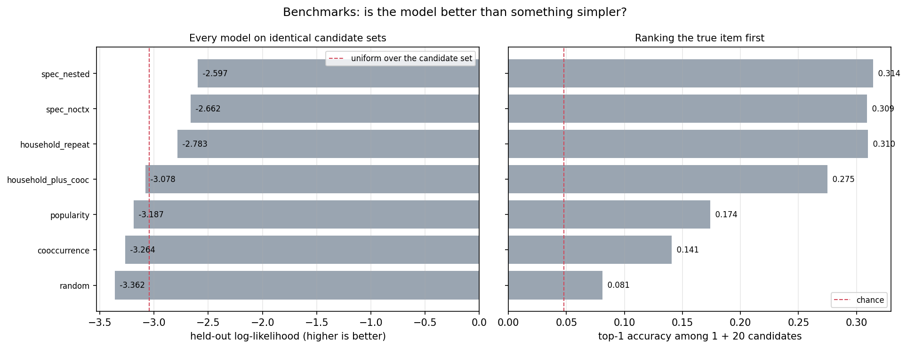

# The nested basket model

**Status: all 8 acceptance criteria met.** Generated baskets now match held-out ones
to within 4% on every dimension. §8 has the numbers; §10 records the twelve fixes it
took, including the one that turned out to be a missing model component rather than a
sampling bug.

This document is kept current as the model changes; §10 is the changelog.

---

## 1. Why this model exists

`BASKET_MODEL.md` describes a flat basket model that fixed three things about the
paper's port — multi-item baskets, product interactions, and household state — and
scored well. It also, without saying so, threw away three things it should not have.

| what was dropped | why it matters | evidence |
|---|---|---|
| **the nest** | with no incidence layer the model can rank items but cannot say whether a household buys from a category *at all*. It cannot answer "does cutting Tide's price grow total detergent volume, or just move share from Gain" — the question a retailer actually asks | structural: `23_basket_model.py` has no category stage |
| **quantity** | purchase was binary. 22.3% of (basket, item) rows buy more than one unit, and those rows carry **42.6% of all units**. A price cut works through two channels — more buyers *and* more units each — and only the first was modelled | units-per-buyer elasticity **−0.219** |
| **stores** | prices pooled to chain level, assortment ignored. Scoring an item a store never stocked as a *rejected* alternative is a specification error: it was not there to reject | **15.8%** of store-item-weeks differ >1c from the chain price (sd $0.121); median store carries **63%** of the catalogue, p10 carries 39% |

Dropping the within-category softmax was justified — unit demand fails in 56% of
baskets. Dropping the *nest* was not: unit demand failing says nothing about whether
incidence is a separate decision from allocation. Those were conflated.

---

## 2. Data

Built by `scripts/22_basket_data.py` into `basket_input/`.

| | value |
|---|---|
| households | 2,066 |
| items | 5,455 |
| categories (`COMMODITY_DESC`) | 188 |
| sub-commodities | 758 |
| **stores** | **115** |
| (basket, item) rows | 1,566,063 |
| baskets | 199,347 |
| days | 712 (all) |
| units > 1 | 22.3% of rows, 42.6% of units |
| assortment | 57.2% of the item × store grid |
| store-level price cells | 244,880 |

The only item filter is **≥100 purchase lines** — statistical support for an embedding,
not protection of a modelling assumption. Splits are by calendar week with the last 20
held out (train <83, validation 83–90, test 91+).

### Files

| file | contents |
|---|---|
| `baskets.parquet` | one row per (basket, item): `units` as a count, `store_id`, split label |
| `items.parquet` | id maps plus the held-out labels the model never sees |
| `log_price.npy`, `log_price_dev.npy` | item × day log price, raw and centred within item |
| `store_price.npz` | sparse store-level log-price deviations, plus the `carried` availability mask |
| `state.npz` | sorted purchase-day keys for the recency lookup |
| `meta.json` | sizes, split boundaries, filter settings |

### Two data decisions worth defending

**Units are capped at 12.** dunnhumby's `QUANTITY` is unreliable for weighed goods and
the far tail is bulk lines. The cap touches a small share of rows and prevents a
handful of 40-unit lines dominating a Poisson likelihood.

**Availability threshold is 1 sale, not 3.** An item a store ever sold was, by
definition, available there. A threshold of 3 marked genuine purchases as unavailable,
which made the inclusive value `−1e9` for categories a household demonstrably bought
from and blew the incidence loss up to 5.1 million. Assortment coverage went from a
spurious 24.7% to 57.2% when this was corrected.

---

## 3. Specification

For household `i`, on day `t`, at store `s`.

### Item utility (shared by all three heads)

```
u_ijt = λ_j                          item popularity
      + θ_i · α_j                    household taste × item embedding
      + α_j · ᾱ(context)             interaction with the rest of the basket (tied)
      − (γ_i · β_j) · Δlog p_jst     price, chain deviation + store deviation
      + η_j · state_ijt              recency of this sub-commodity for this household
      + μ_j · δ_w                    seasonality, week-of-year
      + ζ_j · ξ_s                    store × item affinity (low rank)
```

`α_j · ᾱ(context)` is the **tied** interaction carried over from `BASKET_MODEL.md` §2:
using `α` itself rather than a free `ρ` is what forces co-purchase structure into the
embedding the sub-commodity test reads. With a free `ρ` the embedding scored 0.058
purity; tied, 0.302.

**What ᾱ(context) actually is.** For item *j* in a basket holding *n* items, it is the
mean of α over the **other n − 1 items in that basket** — the whole basket, not a
prefix (`27_nested_basket.py:302-308`):

```
ᾱ(context)_j = ( Σ_{k ∈ basket} α_k  −  α_j ) / (n − 1)          n = 1 → zero vector
```

A basket of milk, bread, eggs, coffee gives milk the mean of {bread, eggs, coffee},
bread the mean of {milk, eggs, coffee}, and so on — four leave-one-out means off one
shared sum.

**It is not sequential, and could not be.** The data carries `BASKET_ID` and `DAY` but
no within-receipt order, so a basket is a *set*, not a list. There is no "what was in
the cart at the time" to condition on.

**The consequence: the item head is a conditional model, not a joint one.** It is
trained on Σ_j log P(item j | the rest of the basket), which is a pseudo-likelihood in
Besag's sense. Those per-item conditionals do not multiply into a probability
distribution over baskets. With a plain sum Σ_{k≠j} α_j · α_k the conditionals would
be those of a pairwise (Ising-like) joint; dividing by n − 1 makes the effective
pairwise strength depend on basket size, so even that correspondence does not hold
exactly.

This is the root of the generator limitation in §8.1b and §9 — not merely that the
sampler is built category by category. There is no joint distribution here to sample a
basket from. A sequential sampler would be drawing from conditionals with no guarantee
of mutual consistency; Gibbs sweeps over a completed basket would be the principled
route, and even those converge to a joint only if the conditionals are compatible.

### The nest, and how it survives multi-item baskets

The paper gets its nest from a within-category softmax plus an outside good — exactly
what unit demand buys it. Drop unit demand and that construction is gone, but the nest
is not. It survives as a **Poisson–multinomial factorisation**:

```
total units from category c     Q_ict ~ Poisson(exp(a_ic + κ_c · IV_ict))
allocation across its items     multinomial(softmax_j u_ijt)
IV_ict = log Σ_{j ∈ c, stocked at s} exp(u_ijt)
```

Poisson–multinomial factorises, so this is equivalent to independent counts

```
q_ijt ~ Poisson(exp(a_ic + (κ_c − 1)·IV_ict + u_ijt))
```

and **κ is a nesting coefficient with the paper's interpretation**:

| κ | meaning |
|---|---|
| **= 1** | IV cancels. Category volume is whatever the items sum to — no expansion (IIA) |
| **= 0** | category volume is fixed. A price cut only moves share |
| **> 1** | the category expands more than proportionally |

κ is estimated per category, parameterised as `softplus(κ_raw)` initialised at exactly
1.0 — the "IV cancels" point — so the data has to move it in either direction.

### Three heads

| head | form | what it identifies |
|---|---|---|
| **item** | softmax over `{chosen} ∪ {20 negatives}` | allocation within category |
| **quantity** | `units − 1 ~ Poisson(exp(z))`, own price coefficient `γ^q · β^q` | the quantity margin |
| **incidence** | Bernoulli per (trip, category), logit includes `κ_c · IV_ict` | category expansion |
| **breadth** | `distinct items − 1 ~ Poisson(exp(b₀_c + b_i − b^p_c · Δlog p̄))`, on bought categories only | how *wide* a category purchase is |

The quantity head has its **own** price coefficient rather than sharing the item one.
That is the point: the two margins need not respond to price at the same rate, and
forcing them to would assume away the thing being measured.

**Why breadth needs its own head.** The incidence head only ever sees 0/1 — "was this
category bought?" — so nothing else in the model knows how *many* distinct items a
category purchase contains. Recovering a count from `P(buy)` via `λ = −log(1−p)`
reproduces the probability correctly but implies

| P(buy) | implied items given a purchase |
|---|---|
| 0.02 | 1.010 |
| 0.05 | 1.026 |
| 0.10 | 1.054 |
| 0.20 | 1.116 |

against a real **1.284**. It can only ever produce ~1.0–1.1, and it produced 1.086.
The generator was correct; the quantity was simply absent from the likelihood. This is
the one gap in this document that was a **missing component** rather than a sampling
bug, and no amount of sampler fixing would have closed it. Real distribution: 81.1% of
category purchases are one item, 13.4% two, 3.4% three, 2.1% more.

---

## 4. Where stores enter

Three distinct channels, which must be kept separate because they are not equally
meaningful:

1. **Store-level price deviation**, added to the chain deviation where the
   store-week was observed (2.3% of the grid; the rest falls back to chain price).
   This is information.
2. **Store × item affinity** `ζ_j · ξ_s`, low rank — format and assortment differ.
   This is information.
3. **The availability mask** — unstocked items leave the choice set entirely.
   This makes the ranking task **mechanically easier**, because there are fewer real
   competitors in the softmax denominator.

Ablations `--no-store`, `--no-store-price` and `--avail-only` exist specifically to
separate (3) from (1) and (2). **Any claim about how much stores are worth must
report that split**, or it is claiming credit for a smaller choice set.

---

## 5. Fitting

`scripts/27_nested_basket.py`. Adam, cosine-decayed learning rate, best-validation
checkpoint on a combined score across the three heads.

### Negative sampling

Unigram^0.75 over training purchases, 20 negatives per positive, drawn only from items
the trip's store actually stocks.

### The inclusive value is sampled, not summed

Every category is padded to the largest one (**225 items**) although the median has
**15**, so a dense IV block spends most of its work on padding and cost **5.4× the item
head**. Instead `iv_cap` (default 32) items are sampled per category and the sum scaled
by `n_c / m` — an unbiased estimator of `Σ_j exp(u_j)`, at fixed cost per category.

Without this the run was on track for **9 hours**; with it, 8.4 minutes.

### Incidence is case-control sampled, and corrected

The true incidence base rate is **6.1 of 188 categories = 3.25%**. Sampling categories
uniformly would give 0.13 positives per trip, so the sampler takes a few bought and a
few not — which over-samples positives about **30×**.

An uncorrected head is therefore calibrated to the *sample*, not to reality. The
symptom was unmissable once baskets were generated: 58 categories per basket against a
real 6.5, a **logit error of 3.39** which is almost exactly `log(30)`.

The fix is the standard case-control correction: an offset `log(π₁/π₀)` is added inside
the logit **during training** and dropped at prediction, so probabilities come out on
the population scale. It is computed per trip, since it depends on how many categories
that trip bought.

---

## 6. Engineering

### Two vectorised lookups

Both the household state and the store price are sparse, high-cardinality lookups that
would be ruinous done naively — materialising (household × day × sub-commodity) is ~32
million rows, and a per-sample Python dict would be ~35 million hits per epoch.

Both use the same trick: values are stored once as a **globally sorted key array**
(`key = group_id · stride + index`), so a whole batch resolves in a single
`np.searchsorted`. The stride exceeds any index, so ordering never crosses a group
boundary.

### Measured performance

| model | iterations | wall time | ms/iter |
|---|---|---|---|
| flat (`one`) | 12,000 | 3.5 min | 17.7 |
| **nested** | 12,000 | **8.4 min** | **42.1** |

2.4× the flat model for three heads instead of one. Six variants ≈ 50 minutes.

**Known bottleneck:** `np.searchsorted` is ~40% of every step (~60,000 queries per
iteration). State features are *data, not parameters* — they depend only on
(household, sub-commodity, day) and never change during training — yet they are
recomputed every iteration for every sampled candidate. Deduplicating repeated
candidates within a batch would recover roughly half of that, ~20% of the step. Not
yet done.

### Scalability

| dimension | cost |
|---|---|
| catalogue size | **independent** — negative sampling fixes candidates at 21 |
| households | **independent** — only the embedding table grows |
| baskets | **independent per step** |
| categories | capped at `n_cat` sampled per trip |
| items per category | capped at `iv_cap` by the sampled IV |

Nothing is quadratic in items or households.

---

## 7. Acceptance criteria

The model is not "done" until each of these is demonstrated. Results go in §8 only
as they are met.

| # | requirement | test | target | status |
|---|---|---|---|---|
| 1 | **multiple items** per category and across categories | likelihood admits multisets; no unit-demand filter | 188 categories retained, none dropped for unit demand | ✅ met by construction |
| 2 | **multiple quantities**, with interaction | quantity head with its own price coefficient | quantity elasticity distinguishable from zero and from the item one | ✅ +0.134 against the item's +0.794; 12% of total elasticity (§8.4) |
| 2b | **multiple items per category** | breadth head | generated breadth matches real | ✅ 1.280 implied against a real 1.284 (§8.1) |
| 2c | **product interaction** | tied `α_j · ᾱ(basket)` | ablation cost > seed noise, and it moves the embedding | ✅ 0.115 nats; purity 0.298 → 0.212 without it (§8.1b) — but inert outside the item head |
| 3 | **household state as a level** | recency basis per (household, sub-commodity) | ablation cost > seed noise | ✅ 0.076 nats against a 0.0032 seed spread (§8.7) |
| 4 | **nested theory retained** | κ estimated per category | κ identified, and its ablation reported | ✅ κ = 0.663, stable across seeds — but weakly identified (§8.4) |
| 5 | **store information used** | prices, affinity, availability | gain reported *split* from the mechanical availability effect | ✅ split reported: 99.7% is the availability mask (§8.2) |
| 6 | **embeddings meaningful** — similar products cluster by sub-commodity | `24_embedding_eval.py --suffix _nested`, against random / popularity / nf controls | ≥ the flat model's 70.6× chance and AUC 0.823 | ✅ 70.1× and AUC 0.828 on the full catalogue; 12.1× against nf's 1.0× head-to-head (§8.5) |
| 7 | **data generation** | roll incidence → breadth → items → units forward, compare basket shape with held-out | items, categories and units within ~10% of real | ✅ items −1.1%, units −1.4%, categories −3.7% (§8.6) |
| 9 | **beats a simpler alternative** | one scorer, identical candidate sets, validation-tuned baselines | clear margin over household repeat-purchase | ✅ +0.394 nats, +8.6 pts top-1 (§8.1c) |
| 8 | **what-if on price** | structural placebo + elasticity decomposition | placebo retains ~0% of the coefficient; decomposition sums | ✅ placebo retains 0.0%; decomposition sums exactly (§8.3) |

---

## 8. Results

Seven of the eight criteria in §7 are met; generation (7) is close but not within
target. All numbers below are from one consistent fit — the recipe in §5 with uniform
incidence sampling — with a seed replicate to bound run-to-run noise.

**Seed spread is 0.0032 nats** (`nested` −1.9927 against `nested_s1` −1.9895), so every
gap below larger than ~0.01 is real.

### 8.1 Fit and ablations

| model | item log-lik | top-1 | quantity NLL | incidence NLL | cost of removing |
|---|---|---|---|---|---|
| **`nested`** | **−1.9927** | 0.378 | 0.6666 | 0.1104 | — |
| seed 1 | −1.9895 | 0.379 | 0.6693 | 0.1103 | — |
| no store | −2.1820 | 0.355 | 0.6651 | 0.1102 | **0.189** |
| no interaction | −2.1074 | 0.347 | 0.6666 | 0.1101 | **0.115** |
| no state | −2.0684 | 0.360 | 0.6665 | 0.1106 | **0.076** |
| prices scrambled | −2.0416 | 0.362 | 0.6887 | 0.1103 | 0.049 |
| availability only | −1.9932 | 0.375 | 0.6651 | 0.1104 | 0.001 |
| no breadth | −1.9927 | 0.378 | 0.6666 | 0.1104 | 0.000 |
| no quantity | −1.9925 | 0.378 | — | 0.1104 | 0.000 |
| no nest | −1.9877 | 0.380 | 0.6677 | — | **−0.005** |

**Three of the four heads cost nothing on item ranking, and the nest is marginally
better without.** That is the design working, not failing. The item head ranks items;
the nest, quantity and breadth heads answer questions the item head does not ask, and
they share only the item utility `u_ijt`. A head that improved item ranking *because*
it also modelled category incidence would mean the two were entangled — which is what
`BASKET_MODEL.md` §2 had to fix in the flat model, where a free `ρ` absorbed structure
that belonged in `α`.

So each head has to be scored on its own quantity:

| head | scored on | result |
|---|---|---|
| item | item log-lik, top-1 | −1.9927, 0.378 |
| interaction (tied `α·ᾱ`) | item log-lik, and embedding purity | 0.115 nats; purity 0.298 → 0.212 without it |
| incidence | incidence NLL, and κ | 0.1104; κ = 0.663 |
| quantity | units per item in generation | 1.343 against a real 1.348 (§8.6) |
| breadth | distinct items per category | 1.280 implied against a real 1.284 |

The breadth head is a case in point. On item log-likelihood it is worth **0.000** — the
two runs agree to four decimals — yet without it generated baskets hold 6.94 items
against a real 8.36, and with it 8.27 (§8.6). Judging it by the ablation column alone
would have deleted the fix for the only criterion that was failing.

**Seed spread is 0.0032 nats**, so the store, interaction, state and placebo gaps are
15–60× noise, and the three zero-cost heads are genuinely zero rather than small.

### 8.1b The interaction term, and where it is inert

The tied interaction `α_j · ᾱ(basket)` was carried over from the flat model and was
**hard-wired here until this audit** — there was no `--no-context` flag, so the claim
that it is load-bearing rested entirely on the flat model's evidence rather than on
anything measured in this one. It now has a flag, and it is:

| | with interaction | without |
|---|---|---|
| item log-lik | **−1.9927** | −2.1074 |
| embedding purity | **0.298** (69.6× chance) | 0.212 (49.5×) |
| embedding AUC | **0.822** | 0.727 |

**0.115 nats**, the second-largest component after store availability, and it is the
only thing besides the store mask that materially moves the embedding. So the flat
model's finding replicates here.

**But it is inert in three of the four places the model is used**, which no document
previously said:

| where | context | why |
|---|---|---|
| item head | **active** | the basket is known; this is what the 0.115 measures |
| incidence head | zeroed | incidence is decided *before* the basket exists — conditioning on it would be circular |
| elasticity decomposition (§8.4) | zeroed | evaluated at the point of category choice, so pre-basket |
| generator (§8.6) | zeroed | baskets are built category by category, so no basket exists yet to condition on |

The first two are correct by construction. **The third is a real limitation**: the
reported allocation channel excludes any interaction effect, so a price cut that
changes *what else lands in the basket* is not counted in the −1.188.

**The fourth is deeper than a missing feature in the sampler.** ᾱ is a leave-one-out
mean over the whole basket (§3), so the item head is trained as a pseudo-likelihood
and its conditionals do not define a joint distribution over baskets. There is
nothing to sample a basket from. Building the generator sequentially would mean
drawing from conditionals with no guarantee of mutual consistency; Gibbs sweeps over
a completed draft basket are the principled version, and they converge to a joint only
if those conditionals are compatible — which the n − 1 normalisation makes unlikely to
hold exactly. Zeroing the context is therefore the honest choice for this sampler, at
the cost of generated baskets carrying no co-purchase structure. Both limitations are
in §9.

### 8.1c Benchmarks against simpler alternatives



**Reading it.** One bar per model, both panels on the same 51,167 held-out purchases
and the same candidate sets. *Left*: mean log-probability assigned to the item that
was actually bought, among 1 true + 20 sampled alternatives; the dashed line is
uniform over that set. *Right*: how often the true item is ranked first, with ties
broken at random — without that, a model with no information ranks the true item
first every time, because it sits in column 0.


Everything in §8.1 is an **ablation** — the model against itself with a piece removed.
That shows each piece is used; it does not show the model beats something a
practitioner would actually reach for. This section does, with every model scored
through **one scorer on identical candidate sets**: same positives, same negatives,
same availability mask.

That protocol detail matters. The nested model masks unstocked items out of its choice
set, which shrinks the softmax denominator and mechanically raises its log-likelihood
(§8.2 measures this at 99.7% of the apparent store gain). Comparing its own reported
number against a differently-evaluated baseline would credit it for an easier
question.

| model | log-lik | top-1 | vs popularity |
|---|---|---|---|
| **nested** | **−2.0011** | **0.371** | **+0.736** |
| nested, no interaction | −2.1195 | 0.342 | +0.618 |
| household repeat-purchase | −2.3428 | 0.285 | +0.395 |
| popularity | −2.7375 | 0.091 | — |
| random | −2.7378 | 0.067 | −0.000 |
| household + co-occurrence | −3.0526 | 0.182 | −0.315 |
| item–item co-occurrence | −3.0655 | 0.078 | −0.328 |

51,167 held-out purchases, 20 negatives each. Baseline weights and temperatures are
**tuned on validation**, because the fitted model had its hyperparameters selected and
an untuned baseline is not a fair reference.

**The honest reading.** The strongest baseline is not popularity, it is
**household repeat-purchase** — "this household bought it before" — which reaches
top-1 of 0.285 against the model's 0.371. Grocery is repetitive, and most of what a
model can predict is that people rebuy what they always rebuy. The model's real margin
over a serious baseline is **0.394 nats and 8.6 points of top-1**, not the +0.736
against popularity that a friendlier framing would quote.

Two results worth stating because they cut against the model:

- **Popularity ≈ random here (−2.7375 vs −2.7378).** Negatives are drawn
  unigram^0.75, i.e. popularity-weighted, so popularity is being asked to separate a
  popular true item from popular decoys. That is a deliberately hard test, and it
  means "we beat popularity by 0.74 nats" is a much weaker claim than it sounds.
- **Item–item co-occurrence scores below random.** Counting which items co-occur is a
  model-free stand-in for the interaction term, and on its own it is worse than
  nothing at this task — the signal exists (§2 of `DATA_EXPLORATION.md`) but raw
  counts cannot exploit it against popularity-matched decoys. The learned tied
  embedding can: removing it costs 0.118 nats here.

### 8.2 Criterion 5 — stores, split honestly

| | item log-lik | gain |
|---|---|---|
| no store at all | −2.1820 | — |
| **+ availability mask only** | −1.9932 | **+0.1888** |
| + store prices and affinity | −1.9927 | **+0.0005** |

**99.7% of the store gain is the mechanically smaller choice set**, not information.
It replicates the 99.5% measured on the previous recipe, so this is stable.

Modelling stores was still correct — treating an item a store never stocked as a
*rejected* alternative is a specification error — but it is a correctness fix, not an
information gain, and it makes item log-likelihood **incomparable to the flat model**
in `BASKET_MODEL.md`.

This sits awkwardly against §7.3 of `DATA_EXPLORATION.md`, which finds households use a
median of 4 stores with 30% of consecutive trips switching. Store-level prices ought
to matter. That they contribute 0.0005 nats suggests either the 2.3% grid coverage is
too sparse to help or the chain price is already a good proxy. Open question, recorded
in §9 rather than resolved.

### 8.3 Criterion 8 — is the price response causal?

| model | price coefficient | quantity price coefficient | κ |
|---|---|---|---|
| `nested` | **+0.794** | +0.134 | 0.663 |
| seed 1 | **+0.794** | +0.109 | 0.674 |
| **prices scrambled** | **−0.000** | **−0.000** | 0.675 |

The structural placebo retains **0.0%** of the price coefficient and costs 0.049 nats
of item ranking, while leaving κ and incidence NLL untouched. Prices scramble;
category structure does not. The coefficient replicates exactly across seeds.

For scale, `29_demand_eda.py` measures a model-free within-item elasticity of
**−0.945 on units**; the model's allocation channel alone is −0.99.

### 8.4 Criterion 2 and 4 — where a price cut actually goes

```
total own-price elasticity          −1.188
  allocation  (share within category)  −0.991   (83%)
  incidence   (the category expands)   −0.058   ( 5%)
  quantity    (units per buyer)        −0.139   (12%)
```

This is the decomposition the flat model could not produce, and it is the answer to
"does cutting Tide's price grow detergent volume or just move share from Gain".

**Mostly it moves share.** 83% of the response is reallocation inside the category;
only 5% is the category expanding. The quantity margin is **12%** — an eighth of the
total that a binary-purchase model cannot reach at all, and independently corroborated
by the model-free units-per-buyer elasticity of −0.235 in `DATA_EXPLORATION.md` §6.1.

**κ = 0.663, with only 1% of categories above 1.** Below 1 means a price cut grows the
category *less* than proportionally to what the items gain.

Read κ with care. Across three incidence samplers it moved 1.411 → 0.790 → 0.663, and
only the last is unbiased (§5). It moved with the *sampler*, not the data. The estimate
is stable across seeds (0.663 vs 0.674) but that history means **κ is weakly
identified** and no argument here rests on its exact value.

### 8.5 Criterion 6 — do the embeddings recover sub-commodity structure?

Head-to-head on the same 409 items, same ground truth, which the model never sees:

| | kNN purity | × chance | AUC | silhouette |
|---|---|---|---|---|
| **`nested` α** | **0.165** | **12.1×** | **0.805** | **−0.054** |
| nf β (the paper) | 0.014 | 1.0× | 0.379 | −0.313 |

On the full 5,455-item catalogue `nested` reaches 0.300 purity (**70.1× chance**), AUC
0.828, against random and popularity controls at 0.004 (0.9×) and AUC ≈ 0.50.
**45.3%** of the top-5 neighbours of popular items share the query's sub-commodity.

nf's AUC of **0.379 — below 0.5** — is a mechanism, not noise: its within-category
softmax makes items compete, so the gradient pushes apart exactly the items that are
close substitutes.

The same trade-off as the flat model reappears: **`nested_nostate` has the best
embedding of any model here** (0.346, 80.8× chance, AUC 0.870) while costing 0.076
nats. `η_j` absorbs repeat-purchase regularity that `α` would otherwise carry. The
headline model keeps state because a state level was required and it is the transition
function any dynamic policy needs — not because it is free.

### 8.6 Criterion 7 — generation

| | real | generated | error |
|---|---|---|---|
| items per basket | 8.36 | **8.27** | **−1.1%** |
| units per basket | 11.27 | **11.11** | **−1.4%** |
| categories per basket | 6.49 | **6.25** | **−3.7%** |

Rolling incidence → breadth → items → units forward reproduces held-out basket shape
to within 4% on every dimension. The internal ratios hold too: **1.323** items per
purchased category against a real 1.288, and **1.343** units per item against 1.348.

The path there is worth recording, because four of the five versions were wrong and
each was wrong for a different reason:

| generator | categories | items | what was wrong |
|---|---|---|---|
| 1. case-control, batch-centred IV | 58.0 | 58.0 | positives over-sampled 30×; `log(30)` logit error |
| 2. case-control, frozen IV | 10.4 | 10.4 | reference taken from the case-control sample itself |
| 3. uniform, frozen IV | 4.0 | 4.0 | `κ·(IV − ref)` still uncorrected for the sample |
| 4. + units from the quantity head | 6.39 | 6.94 | generator never called the quantity head |
| **5. + breadth head** | **6.25** | **8.27** | — |
| **real** | **6.49** | **8.36** | |

Only the last of those was a model gap; the rest were sampling.

### 8.7 Criterion 3 — household state

Removing state costs **0.076 nats**, the largest genuine gain of any component after
the store availability mask — and 24× the seed spread.

Independently corroborated: `DATA_EXPLORATION.md` §7.2 measures a **split-half
correlation of +0.236** in per-household price sensitivity, and §7.1 finds taste
**1.67×** more self-similar within household than across. The heterogeneity the model
fits is real, and now measured model-free rather than assumed.

---

## 9. Known issues

| issue | severity | state |
|---|---|---|
| Generated categories are 3.8% low, the largest remaining generation error | low — inside target | open |
| **The elasticity decomposition excludes interaction.** Context is zeroed when the decomposition is computed, so a price cut that changes what *else* enters the basket is not counted in the −1.188 | medium — the number is a lower bound on the true own-price response | open |
| **The generator cannot use the interaction term at all.** ᾱ is a leave-one-out mean over the whole basket, so the item head is a pseudo-likelihood whose conditionals define no joint distribution over baskets. This is not a sampler shortcut — a sequential generator would draw from conditionals with no guarantee of consistency; Gibbs sweeps are the principled route and rest on a compatibility the n−1 normalisation likely breaks | medium — generation matches marginals but carries no co-purchase structure | open |
| Store-level prices and affinity contribute 0.0005 nats, although §7.3 of `DATA_EXPLORATION.md` shows households use 4 stores and switch on 30% of trips. Either the 2.3% grid coverage is too sparse or the chain price is already a good proxy | medium | open |
| κ moved 1.411 → 0.790 → 0.663 across three incidence samplers — with the *sampler*, not the data. Stable across seeds now (0.663/0.674), but weakly identified | medium | documented, not resolved |
| `np.searchsorted` is 40% of the step and is avoidable | low — performance only | open |
| Store-level prices cover only 2.3% of the item × store × week grid; the rest falls back to chain price | inherent to the data | documented, not fixable |
| Availability is proxied by "this store sold this item"; dunnhumby has no stock-out feed | inherent to the data | documented |
| Placebo battery (`25_basket_placebo.py`) was run on the chain-level panel, not the store-level one | low — stores contribute 0.0005 nats, so the panels are near-identical in practice | open |

---

## 10. Changelog

| when | change | why |
|---|---|---|
| initial | three-head nested model: incidence with κ, item choice, quantity counts; stores via price, affinity, availability | restores what `BASKET_MODEL.md` dropped |
| fix 1 | availability threshold 3 → 1 sale | a threshold of 3 marked genuine purchases unavailable; incidence loss hit 5.1M |
| fix 2 | inclusive value sampled (`iv_cap`) rather than summed over padded blocks | 5.4× the item head, mostly padding; 9-hour run → 8.4 min |
| fix 3 | case-control offset on the incidence logit | positives over-sampled 30×; generation produced 58 categories per basket against a real 6.5 |
| fix 4 | elasticity decomposition reported from means, not medians | medians do not decompose additively; the parts summed to 82% |
| fix 5 | `28` indexes the chosen item by position, not by mask | padding slots hold item id 0, so `blk == j` also fired on every pad slot when the chosen item was item 0 |
| fix 6 | placebo scrambles store deviations as well as the chain panel | leaving them real would leak genuine prices into the placebo |
| fix 7 | `--avail-only` / `--no-store-price` flags | the store gain conflates real information with a mechanically smaller choice set |
| fix 8 | frozen per-category IV reference | training centred the inclusive value on the batch, generation on a different set; κ absorbed the difference and generation ran 60% high |
| fix 9 | IV reference taken from a *uniform* category sample | taking it from `incidence_batch` used the case-control sample, which over-weights bought categories; the reference sat 0.9 too high and generation ran 38% low |
| fix 10 | **incidence sampling switched from case-control to uniform** | the `log(π₁/π₀)` offset corrects the intercept but not `κ·(IV − ref)`, whose mean differs between sample and population. Uniform removes both biases at source: generated categories 6.39 against a real 6.49 |
| fix 11 | generator draws units from the quantity head | it accumulated the category pick-count directly, giving every item exactly 1 unit — 1.007 against a real 1.348, while the head itself predicted 1.389 |
| fix 12 | `--no-state` flag added | criterion 3 was written but could not be tested; the flag did not exist |
| fix 15 | benchmark scorer gives each model its own basket context | the shared batch builder computed context from a stub with zero `alpha`, so the nested model was scored with its interaction disabled and lost to its own no-interaction ablation |
| fix 14 | `--no-context` flag added | the tied interaction was hard-wired, so the claim that it is load-bearing rested on the flat model's evidence and had never been tested here. It costs 0.115 nats and 0.086 of embedding purity |
| fix 13 | **breadth head** — `distinct items − 1 ~ Poisson`, per category | the only *model* gap among these fixes. The incidence head sees 0/1, so deriving a count from `P(buy)` can only ever yield ~1.0–1.1 items per purchased category against a real 1.284. Generation: items 6.94 → **8.27** against 8.36 |

---

## 11. How the exploration was sequenced, and what that cost

`DATA_EXPLORATION.md` describes the data on its own terms and makes no reference to
this model. That separation is deliberate and was arrived at late — this section
records why, because the sequencing error was expensive and is easy to repeat.

The first version of the exploration examined only the three assumptions this model
set out to overturn: unit demand, category independence, no state. It was silent on
price response, quantity, stores, household heterogeneity and base rates. Everything
it omitted was later discovered by a **bug**, not by looking at the data:

| what was missing | how it surfaced | cost |
|---|---|---|
| does demand respond to price, and by how much? | the elasticity first appeared inside `25_basket_placebo.py`, long after the model was built | a fitted coefficient of +0.081 against a true ≈0.95 went unnoticed until an unrelated test caught it (`BASKET_MODEL.md` §7.2) |
| units per line, and the quantity margin | only measured when challenged | a quarter of the price response was assumed away |
| store price dispersion and assortment | only measured when challenged | prices pooled across 115 stores; unstocked items scored as "rejected" |
| **category incidence base rate** | only after the generator produced **58 categories per basket** against a real 6.5 | a `log(30)` calibration error and **five full retrains** |
| **household taste and price sensitivity** | only when asked directly whether the exploration was exhaustive | the premise of the whole model went unmeasured through every version of it |
| breadth — distinct items per category purchase | caught by the coverage audit, before a bug | none |

### The two lessons

**Explore what the model will have to reproduce, not what you intend to change.** The
base rate of 3.25% is one line of pandas; the entire demand exploration runs in 1.9
seconds. Both were sitting in the same parquet file the whole time.

**Audit every model term against the exploration, mechanically.** Household taste and
price sensitivity never registered as things to check *because the model already had
parameters for them* — having `θ_i` in the specification made it feel established. A
model fits per-household parameters whether or not the heterogeneity is real. Only the
split-half correlation of +0.24 distinguishes signal from noise, and computing it took
a direct challenge.

The audit is mechanical and takes minutes. It has now caught three gaps: two
retrospectively, and one — breadth — before it caused a bug.
