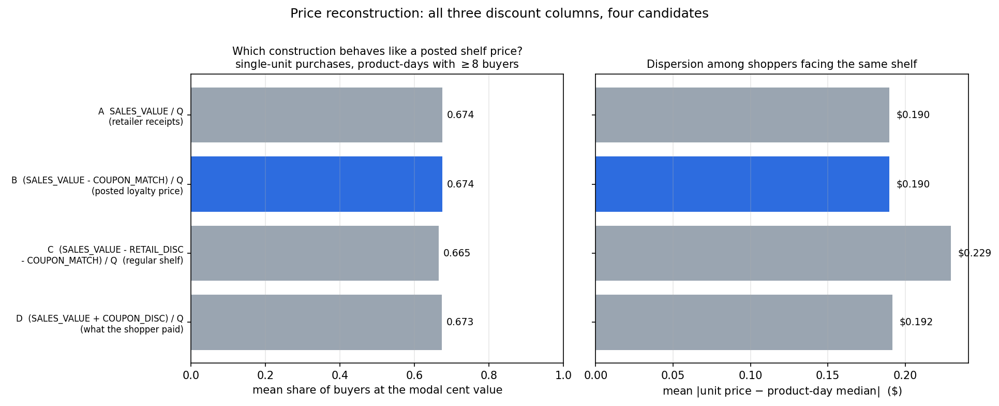
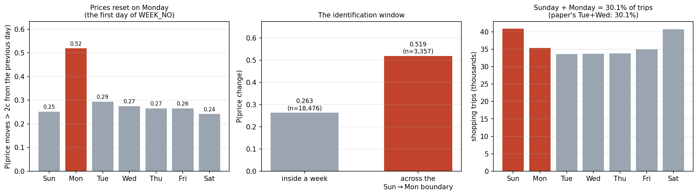
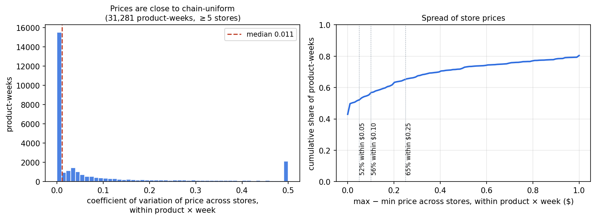
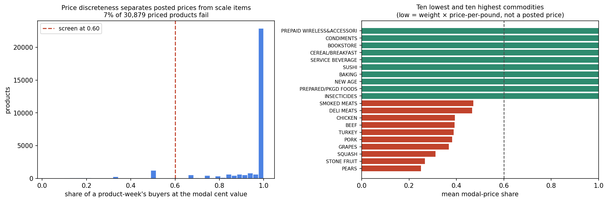
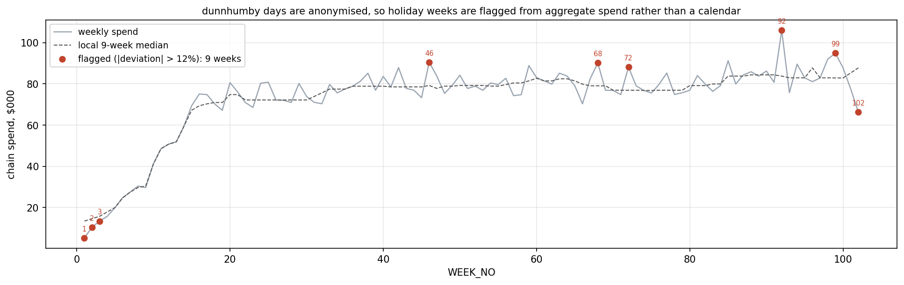
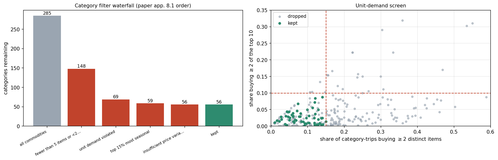
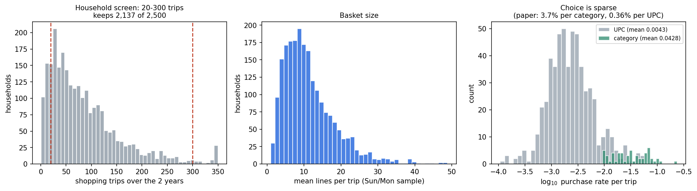
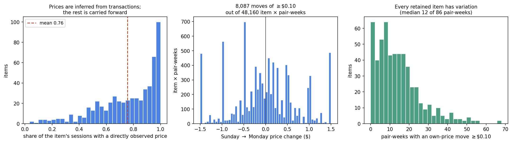
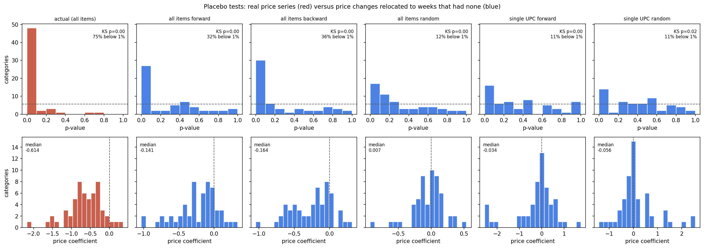

# How the dunnhumby data was prepared

Read `FLOW.md` first if you want the end-to-end map. This document explains each
preprocessing decision: what the problem was, what was done, and what the evidence is.

Every number and figure here is produced by a script — nothing is typed in by hand.
Regenerate everything with `bash scripts/run_all.sh`, or section by section:

| section | script | what it writes |
|---|---|---|
| 1. Working out the price | `10_price_definition_audit.py` | `out/price_audit.json`, `figures/price_definitions.png` |
| 2. Finding when prices change | `01_build_base.py`, `12_preprocessing_figures.py` | `figures/week_structure.png` |
| 3. Handling 561 stores | `12_preprocessing_figures.py` | `figures/cross_store_prices.png` |
| 4. Removing weighed items | `02_select_sample.py`, `12_…` | `figures/random_weight_screen.png` |
| 5. Removing holiday weeks | `02_select_sample.py`, `12_…` | `figures/holiday_weeks.png` |
| 6. Choosing categories | `02_select_sample.py`, `12_…` | `data/filter_audit.csv`, `figures/category_funnel.png` |
| 7. The final sample | `12_…` | `figures/sample_profile.png` |
| 8. Filling in missing prices | `03_make_model_inputs.py`, `12_…` | `figures/price_panel.png`, `model_input/events.csv` |
| 9. Testing whether it is trustworthy | `11_placebo_tests.py`, `13_placebo_followup.py` | `out/placebo_tests.csv`, `figures/placebo.png` |

---

## 1. Working out the price

### The problem

`transaction_data.csv` has no price column. It has `SALES_VALUE` — the money the
retailer received — and three separate discount columns. To model choice we need to
know the price on the shelf tag, because that is what every shopper saw, including the
ones who walked past.

The three discount columns mean genuinely different things:

| column | what it is | how often it applies | how big when it does |
|---|---|---|---|
| `RETAIL_DISC` | the store's own loyalty-card discount — the sale price | **50.0%** of lines | 26.8% off the full price |
| `COUPON_MATCH_DISC` | the store matching a manufacturer's coupon that *this* shopper brought | 0.68% of lines | 17.8% off |
| `COUPON_DISC` | the manufacturer's own coupon, which the manufacturer later repays the store | 1.23% of lines | 37.5% of what the shopper paid |

All three are stored as **negative numbers**. So *subtracting* one of them **adds the
money back on**. (Six lines out of 2.6 million have a positive value — evidently
returns; they get dropped anyway.)

### The user guide's formulas are labelled the wrong way round

The dunnhumby user guide (p.3) offers two formulas:

```
Loyalty card price     = (sales_value - (retail_disc + coupon_match_disc)) / quantity
Non-loyalty card price = (sales_value -  coupon_match_disc) / quantity
```

But the same page works through an example. For a line with `SALES_VALUE = 2.00`,
`RETAIL_DISC = −1.34`, `QUANTITY = 2`, it says:

> "To determine the regular shelf price of the product (exclusive of loyalty card
> discount) … ($2 + $1.34)/2 = $1.67. The shelf price of the product **including**
> loyalty card discount is $2/2 = $1."

Work the first formula through: `(2.00 − (−1.34)) / 2 = $1.67`. The formula is labelled
"loyalty card price", but the guide's own sentence calls $1.67 the price *excluding* the
loyalty discount. **The two labels are swapped.** `10_price_definition_audit.py` finds
that exact row in the real file and reproduces both numbers, so this is a fact about
the shipped data, not an interpretation of the PDF.

Taking the worked examples as authoritative:

```
full price, no loyalty card = (SALES_VALUE − RETAIL_DISC − COUPON_MATCH_DISC) / QUANTITY
shelf price for card holders = (SALES_VALUE − COUPON_MATCH_DISC) / QUANTITY   ← we use this
what the shopper handed over = (SALES_VALUE + COUPON_DISC) / QUANTITY
```

### Why each discount is treated the way it is

**`RETAIL_DISC` stays subtracted out** — i.e. we use the sale price, not the full price.
Every household in this panel carries a loyalty card. Adding the discount back would
model shoppers as facing a price that literally none of them paid.

**`COUPON_MATCH_DISC` gets added back.** This discount fires only because one particular
shopper walked in holding a manufacturer's coupon. It is not on the shelf tag. Leaving
it in would make the shelf look cheaper for coupon users than for everyone else standing
in the same aisle.

**`COUPON_DISC` is left alone.** The manufacturer repays the store for this, so it is
already inside `SALES_VALUE`, and it does not change the shelf tag either. It *does*
change what the shopper personally paid, which is why it is not thrown away: it flags
coupon usage, and household-level coupon eligibility goes into the model as its own
separate effect (`04_extras.py`) rather than being hidden inside the price.

### Checking this against the data

A shelf tag is the same for everyone buying that product that day. So the right price
definition should be the one where shoppers **agree** most — where most of them are
recorded at the same number.

The test: take only single-unit purchases (so a "2 for $3" deal cannot explain
disagreement), on product-days where at least 8 different people bought — 10,172
product-days, 138,429 lines. Then ask what fraction of buyers sit at the single most
common price to the cent.



**Reading the figure.** Four candidate formulas, left bar chart: how often buyers agree
on the price (higher = more like a real shelf tag). Right chart: how far a typical
buyer sits from that day's middle price (lower is better). The blue bar is the
definition we use.

| definition | buyers agreeing on the price | typical distance from the day's middle price |
|---|---|---|
| A `SALES_VALUE / Q` | 0.6742 | $0.1897 |
| **B `(SALES_VALUE − COUPON_MATCH) / Q`** | **0.6744** | **$0.1897** |
| C `(SALES_VALUE − RETAIL_DISC − COUPON_MATCH) / Q` | 0.6645 | $0.2294 |
| D `(SALES_VALUE + COUPON_DISC) / Q` | 0.6732 | $0.1916 |

C — the full, non-loyalty price — is clearly worst. Adding the loyalty discount back
makes buyers *disagree* 21% more, because the discount is a promotion that not every
product-day has. That rules it out.

A and B look nearly identical, but only because the coupon-match discount fires on
0.68% of lines and is drowned out in the average. Zooming in on exactly those lines
settles it. Take product-days where *some* shoppers used a coupon match and others
didn't, and ask how far the coupon users sit from the normal price that day:

| definition | gap for shoppers with a coupon match | gap for everyone else |
|---|---|---|
| A (leaves the match in) | **−$0.357** | −$0.001 |
| B (adds the match back) | **$0.000** | −$0.001 |

Definition B puts coupon users **exactly on the shelf price**. That confirms both that
`SALES_VALUE` really is net of the coupon match, and that adding it back is correct.

Running the mirror test on `COUPON_DISC`: leaving it alone keeps those shoppers on the
shelf price (−$0.004), while subtracting it drops them **$1.73 below** it. So
`COUPON_DISC` must *not* go into the price. Both decisions are now evidence-based
rather than a reading of an ambiguous manual.

### What is left unexplained

Even with the right formula, buyers agree on the price only ~67% of the time.
`RETAIL_DISC` is identical for all single-unit buyers on just 50% of product-days. Some
of that is different stores charging different prices — §3 measures that. Some is
multi-buy mechanics we cannot see. The daily median price used downstream is a robust
summary that shrugs off both.

---

## 2. Finding when prices change

### Why this matters more than anything else here

To learn how shoppers respond to price, you need moments where the price changed and
*nothing else did*. The paper had a clean one: their store changed prices at midnight
on Tuesday, so comparing Tuesday's shoppers with Wednesday's isolates the price change.
Without an equivalent, the whole exercise fails.

### What dunnhumby's calendar actually looks like

dunnhumby anonymises dates — there is a `DAY` number from 1 to 711 and nothing else. So
the weekday has to be inferred. Shopping volume gives it away: the two busiest days of
the seven-day cycle are the weekend. From there everything else lines up, and it turns
out `WEEK_NO` runs **Monday to Sunday** (101 of the 102 weeks start on the same slot).

Then the key measurement. For pairs of consecutive days where enough people bought a
product to pin down its price, how often does the price move by more than 2 cents?



**Reading the figure.** *Left*: chance of a price change, by which day of the week you
land on. Monday is roughly double every other day. *Middle*: the same thing as two
bars — within a week versus across the Sunday-to-Monday boundary. *Right*: how many
trips happen on each day, with Sunday and Monday highlighted.

| day pair | chance the price changed | number of comparisons |
|---|---|---|
| two days inside the same week | 0.263 | 18,476 |
| Sunday → Monday (across the week boundary) | **0.519** | 3,357 |

**This retailer resets prices on Monday.** So the dunnhumby equivalent of the paper's
Tuesday/Wednesday pair is **Sunday of one week paired with Monday of the next** — the
pipeline calls this a *pair-week*. That pair is **30.0%** of all trips; the paper's
Tuesday+Wednesday was 30.1%. The identification strategy transfers almost exactly.

The 26.3% of apparent within-week "changes" are not real price resets — they come from
computing a daily price off a handful of transactions, plus multi-buy deals shifting
the middle. Assigning one price per week removes them by construction.

**One honest caveat.** Sunday and Monday differ far more in shopping behaviour than
Tuesday and Wednesday do — Sunday is a big shopping day, Monday is not. The model has
a term that absorbs a constant Sunday-vs-Monday difference for each category, exactly
as the paper absorbs its Wednesday effect. Whether that is enough is precisely what
§9 tests.

---

## 3. Handling 561 stores when the paper had one

### The problem

The paper studied a single store in an isolated location. dunnhumby covers 561 stores,
and no single one is big enough to use on its own: the largest holds 2.6% of all
baskets, the top ten together only 17.8%. Households are loyal but not exclusive — the
typical household makes 74% of its trips at one store.

We also have a hard constraint from the modelling side: the authors' code stores prices
as a single table of *item × time*, with one price per item per time slot shared by
everyone. It cannot represent "this household saw a different price". So prices must be
pooled to chain level. The question is what that costs.

### Measuring the cost



**Reading the figure.** *Left*: for each product in each week, how much its price varies
across stores, expressed as a percentage of the price. *Right*: the cumulative version —
what share of product-weeks have all stores within 5c, 10c, 25c of each other.

Within a product-week, the typical spread across stores is **1.1% of the price**. This
retailer sets prices close to chain-wide. So sessions are defined as **one chain-wide
calendar day**, and prices as the chain-wide weekly middle price.

This is the single largest approximation in the whole port, and the tail is real: 35%
of product-weeks do have stores more than 25 cents apart. `VERIFICATION.md` §1 takes
this further and tests whether the approximation actually damages the fit. It does, a
little: households whose stores sit furthest from the chain price fit 0.08 nats worse
than those whose stores sit closest — small against the 0.48-nat gap between the full
model and the homogeneous baseline, but no longer nothing. It also finds a related
problem it does *not* solve: stores stock different things, and the median store only
ever sells 67% of the products we model.

---

## 4. Removing items sold by weight

### The problem

For loose fruit, the deli counter, and fresh meat and fish, `QUANTITY` counts *scans*,
not pounds. So `SALES_VALUE / QUANTITY` is weight × price-per-pound — not a price. Two
shoppers standing in front of the same $1.99/lb sign will be recorded at $1.31 and
$2.68 depending on how big a bag of grapes they picked up.

Feed that to a model and you are asking the price coefficient to explain how heavy
people's shopping was.

### Spotting them without being told

A posted price is a **round, repeated number**: nearly every buyer records $1.99. A
weighed item produces a smear of values that almost never repeat. So measure, for each
product within each week, what share of buyers sit at the single most common cent value.



**Reading the figure.** *Left*: the distribution of that score across all products. It
is strongly bimodal — a large pile near 1.0 (posted prices) and a small tail near 0
(weighed items). The dashed line is the cutoff at 0.60. *Right*: the ten lowest and ten
highest categories, which is the sanity check that the score is measuring what we think.

| lowest score | | highest score | |
|---|---|---|---|
| GRAPES | 0.10 | ORAL HYGIENE PRODUCTS | 0.98 |
| STONE FRUIT | 0.13 | HOUSEHOLD CLEANING | 0.98 |
| CHICKEN | 0.19 | CANNED MILK | 0.99 |
| PORK | 0.20 | NUTS | 0.99 |
| DELI MEATS / TURKEY / BEEF | 0.23–0.25 | MAGAZINES | 0.99 |
| SALAD BAR | 0.31 | DOMESTIC WINE | 1.00 |

The bottom of the list is fresh meat, fish, loose fruit and the salad bar; the top is
packaged goods. The score has found the scale without ever being told what a scale is.

**2,208 of 30,879 priced products (7.2%) score below 0.60 and are dropped.** (Inside the
retained Sunday/Monday window the same screen sees a slightly smaller catalogue and
flags 2,142 of 30,452 — that is the number the pipeline prints.) The paper's retailer
recorded genuine per-unit prices and needed no such step.

**A mistake worth recording.** The first version of this screen had a fallback: for
products too thinly sold to measure inside one week, it pooled all that product's
transactions across the whole two years. That is wrong, and badly so — an ordinary
product whose price changed four times over two years will look exactly like a weighed
item under that measure. It flagged 54% of thin products and **1,989 high-volume
products** as weighed. The corrected screen never pools across weeks; it just relaxes
the threshold (5 buyers in a week, then 3, then 2). Fixing it moved the sample from 62
categories / 620 items to 56 / 560, because legitimate products came back into
contention and more categories then failed the one-item-per-trip test. Every number in
these documents is post-fix.

---

## 5. Removing holiday weeks

### The problem

The paper drops the weeks before Halloween, Thanksgiving, Christmas, July 4th and Labor
Day, because shopping in those weeks is not comparable to normal shopping and prices
move for reasons that have nothing to do with ordinary demand. dunnhumby's dates are
anonymised, so there is no calendar to look at.

### The workaround

Flag weeks where total chain-wide spending deviates more than 12% from its own local
trend (a rolling nine-week middle). A holiday shows up as a spike whether or not you
know what it is called.



**Reading the figure.** Grey line: total spending each week. Dashed line: the local
trend it is compared against. Red dots: the nine flagged weeks, labelled with their
week number.

Nine weeks are flagged: 1, 2, 3, 46, 68, 72, 92, 99, 102. Weeks 1–3 and 102 are partial
weeks at the very start and end of the panel. The rest fall roughly 52 weeks apart from
one another, which is what an annual holiday looks like when you cannot see its name.

A pair-week is dropped if either of the two calendar weeks it straddles is flagged.
**87 of 101 pair-weeks survive.**

---

## 6. Choosing which categories to model

### What a "category" is here

The model assumes a shopper buys **at most one** item from a category on a trip. That is
what makes "which paper towel?" a well-defined question. dunnhumby's hierarchy has three
levels — DEPARTMENT → COMMODITY_DESC → SUB_COMMODITY_DESC — and `COMMODITY_DESC` is the
one that matches the paper's "category".

`SUB_COMMODITY_DESC`, `BRAND` and `MANUFACTURER` are deliberately **kept away from the
model**. They are held in reserve as an exam: if the model has genuinely learned which
products are similar, its own internal notion of similarity should line up with those
labels even though it never saw them. (`VERIFICATION.md` §2 grades that exam: it passes,
but only modestly.)

### The filters

These are the paper's own five filters, with the only change being Tuesday→Wednesday
becoming Sunday→Monday.



**Reading the figure.** *Left*: how many categories survive each filter, applied in
order — 285 at the start, 56 at the end. *Right*: the one-item-per-trip test. Each dot
is a category; the axes are how often shoppers buy two or more items from it on one
trip. Red lines are the cutoffs; green dots are kept.

| filter | what it removes and why | categories cut |
|---|---|---|
| too thin | fewer than 5 items, or under 200 category-purchases in our window. Nothing to estimate. | 137 |
| one item per trip is violated | more than 15% of shoppers buy two or more from the category on one trip — so it isn't really a single choice | 79 |
| too seasonal | the 15% of categories whose sales are most concentrated in a few days of the year | 10 |
| not enough price movement | fewer than 2 items ever change price, or no item moves 10c in at least 10% of weeks | 3 |
| prices move together | if every item in the category goes on sale at once you cannot tell substitution apart | 0 |
| **kept** | | **56** |

The starting point is 285 commodities, after removing non-merchandise (fuel, postage,
lottery tickets, coupon lines, "no commodity description").

The paper kept 123 of 235; we keep 56 of 285. Almost all of that difference is the
"too thin" filter, and it binds because we have 49,729 trips spread over 561 stores
where they had 100,504 in one.

Within each surviving category we keep the **10 most-bought items** — the paper's
choice. Where a shopper did buy two items from one category on a trip, one is kept at
random, again as in the paper.

---

## 7. What the final sample looks like



**Reading the figure.** *Left*: how many trips each household makes, with the 20–300
cutoffs marked — this is the paper's rule for excluding households too light or too
heavy to be typical. *Middle*: average basket size in the Sunday/Monday sample.
*Right*: how often a given product or category is bought, on a log scale. The point is
how far left both distributions sit.

| | this port | the paper |
|---|---|---|
| households | 2,084 | 2,068 |
| categories | 56 | 123 |
| items (10 per category) | 560 | 1,263 |
| trips | 49,729 | 100,504 |
| sessions | 172 days (86 pair-weeks) | ~176 days |
| observed category purchases | 66,638 | 455,445 |
| how often a category is bought, per trip | 2.3% | 3.7% |
| households with demographics on file | 37% | all of them |

**Why the 2.3% matters.** On any given trip a shopper buys from a given category only
2.3% of the time. That is the whole reason the model has a two-level structure. If
"buy nothing" sat in the same bucket as the ten products, the arithmetic of the model
would say that raising the price of one paper towel sends almost everybody to *no paper
towels at all* rather than to a different brand — because "nothing" is what they
usually do. Splitting the decision into "do I buy paper towels?" and "which one?" fixes
that.

**Demographics are thin.** Only 801 of the 2,500 households have any recorded age,
income or household size. Missing values are filled with zeros after standardising and
flagged with an indicator, so the model's demographic term stays defined for everybody.
As it turns out (`VERIFICATION.md` §3), demographics contribute nothing to held-out
accuracy anyway.

**How the data is split.** Not randomly by trip. By **household × pair-week**: a
household is in the training data, but particular *weeks* of its shopping are hidden.
That forces the model to predict a household it has met, in a week it has not seen, on
the very day a price moved — which is the prediction we care about.

---

## 8. Filling in the prices nobody paid

### The problem

We only observe a price when somebody bought the thing. For the model we need a price
for **every** item on **every** day, because the model has to know what the shopper
turned down.

### The fix

Chain-wide middle price for each product each week; carry the last known price forward
into weeks with no sales; fill any remaining gap at the start of the series backwards.
This is the paper's own procedure ("in the event of a day with zero purchases, we carry
forward the price data from the previous day").



**Reading the figure.** *Left*: for each item, what share of its 172 days had a price we
actually observed rather than carried forward. *Middle*: the sizes of Sunday-to-Monday
price changes — the natural experiments the model learns from. *Right*: how many such
changes each item contributes, confirming that no item is carrying the whole result.

**49.2% of item-weeks have a directly observed price**; the rest are carried forward.
What that buys us:

| | count |
|---|---|
| item × pair-week combinations | 48,160 |
| where the item's own price moved by at least 10c | 8,087 |
| where a *different* item in the same category moved | 32,446 |
| typical size of a move | $0.70 |

Those 8,087 own-price moves are the natural experiments. Each one is one product, one
week, where the price changed between Sunday and Monday and we can watch what happened.

**One thing we simply do not have.** The paper's store recorded when items went out of
stock, and used that as a third natural experiment. dunnhumby has no such feed, so that
part of the paper cannot be reproduced at all.

---

## 9. Testing whether any of this is trustworthy

**This should have been run first, not last.** Everything above builds a price variable
and picks a comparison window. This section is the test of whether that window actually
isolates price — and it belongs before a single model is fitted.

### The idea, in plain terms

We are claiming that when we compare Sunday shoppers with Monday shoppers, the only
thing that changed is the price. If that is true, then a fake price change should do
nothing. So: take each product's real sequence of price changes and **move them to
weeks when the price did not actually change**, keeping everything else identical.
Refit. Any "price effect" that survives was never about price — it was the model
picking up something else that happens to move on the same schedule.

Three ways of moving them, each tried on one product at a time and on all products at
once:

* **forward** — each change slides to the next quiet week (the paper's own rule)
* **backward** — slides to the previous quiet week
* **random** — changes scattered at random over the quiet weeks

The whole price path is rebuilt each time. My first attempt just swapped a change week
with a nearby quiet one, which leaves every untouched week at its real price and smuggles
genuine price variation back into the "placebo" — the same trap the paper warns about
when it rejects a naive one-week shift.

The model used is the paper's simple baseline (a plain choice model per category, ten
items plus the option to buy nothing), fitted separately for each category. Standard
errors are **clustered by household**, because the same household appears dozens of
times and pretending its trips are independent would make everything look more certain
than it is.

### Results



**Reading the figure.** *Top row*: the distribution of p-values across the 56
categories. A p-value is the chance of seeing an effect this big if there were really
no effect — so under a genuine fake, these bars should be flat at the dashed line.
*Bottom row*: the estimated price effects themselves. Red is the real price data, blue
is the fakes. The real data (far left) piles up at p ≈ 0 and centres at −0.61; a
working fake should look like the fourth panel, centred on zero.

| price series | typical price effect | categories significant at 1% | how much of the real price *level* survives in the fake |
|---|---|---|---|
| **real prices** | **−0.614** | **75.0%** | 1.00 |
| all items, forward | −0.141 | 32.1% | 0.58 |
| all items, backward | −0.164 | 35.7% | 0.49 |
| **all items, random** | **+0.007** | **12.5%** | 0.12 |
| single item, random | −0.056 | 10.7% | 0.06 |

Clustering by household inflated the standard errors by only 1.0–1.1×, so that is not
what is driving anything below.

**Three things to take from this.**

1. **The forward and backward fakes are not clean fakes.** Sliding a price change by one
   or two weeks leaves the price *level* still 49–58% correlated with the real one, so
   real price response leaks into the "placebo". Their non-zero effects are therefore
   not evidence of a problem. This applies to the paper's own rule too — which means
   their "13 of 123 categories fail" is not the clean measure it appears to be.

2. **The random fake is the real test, and the design passes it.** It is the only rule
   that genuinely breaks the link with the real price path (correlation 0.12). Under it,
   the estimated price effect **collapses from −0.614 to +0.007** — essentially zero.
   Our Sunday/Monday window is not manufacturing price effects out of thin air.

3. **But it does not pass cleanly.** Under a genuine fake, 1% of categories should be
   significant at the 1% level. **12.5% are.** Roughly one category in eight has prices
   and demand moving together for reasons the week and weekday controls don't absorb.

Overall: **31 of 56 categories fail at least one of the six fakes; 10 fail the clean
random one.** The paper reported 13 of 123. The identification here is genuinely
weaker — which is what you would expect when prices are averaged across 561 stores and
the comparison days are Sunday and Monday rather than two quiet mid-week days.

### What was done about it

`13_placebo_followup.py` writes a verdict for every category to
`out/placebo_category_status.csv`. 25 categories pass every fake; 46 pass the random
one. `02_select_sample.py --exclude-placebo-failures` rebuilds the sample without the
failures.

Re-scoring the already-fitted models on only the surviving categories:

| categories used | full model | full model + extras | no cross-category pooling | no personalisation |
|---|---|---|---|---|
| all 56 | −4.239 | −4.242 | −4.279 | −4.715 |
| pass the random fake (46) | −4.210 | −4.210 | −4.242 | −4.702 |
| pass every fake (25) | −4.340 | −4.342 | −4.378 | −4.882 |

*(higher is better; these are held-out log-likelihoods)*

The ordering is identical everywhere, and the gap between the full model and the
no-personalisation baseline actually **widens** on the clean categories, from 0.48 to
0.54. Retraining from scratch on the 46 random-placebo-clean categories gives the same
story: −4.196 for the full model against −4.614, with the spread of household price
sensitivities still four times larger (0.79 against 0.20).

### What this means in practice

- **Comparing models is safe.** Whatever contamination exists is in the data that all
  four models see equally.
- **Individual price elasticities are not safe** in the 10 categories that fail the
  clean fake, and should be treated with suspicion in the 31 that fail any of them.
- Anything that turns an elasticity into a pricing decision should be run on the clean
  subset only. That is what the `--exclude-placebo-failures` switch is for.

---

## 10. Every judgement call in one table

| decision | what else was considered | why this one | evidence |
|---|---|---|---|
| price = `(SALES_VALUE − COUPON_MATCH_DISC) / QUANTITY` | add the loyalty discount back; subtract the manufacturer coupon | every household has a card; a coupon match is personal to one shopper; a manufacturer coupon doesn't change the shelf tag | §1 |
| chain-wide daily sessions | one session per store per day | the authors' code needs one price per item per session; stores differ by only 1.1% | §3 |
| drop items sold by weight | keep them and accept the noise | their "unit price" is really weight, not price | §4 |
| Sunday + Monday only | use all seven days | prices reset on Monday: 52% chance of a change vs 26% | §2 |
| holidays flagged from spending | guess the calendar | dunnhumby anonymises dates | §5 |
| category = `COMMODITY_DESC` | the finer `SUB_COMMODITY_DESC` | matches the paper's level, and leaves sub-commodity free to test the model with | §6 |
| top 10 items per category | every item | the paper's choice; keeps the price table manageable | §6 |
| weekly price, carried forward | a fresh price every day | apparent within-week changes are sampling noise | §2, §8 |
| split by household × week | split trips at random | forces prediction into weeks never seen, which is the real task | §7 |
| price discreteness measured within a week | pool a product's whole history | pooling confuses a weighed item with an ordinary price change | §4 |
| keep the 13 placebo-failing categories in the headline sample | drop them | the model ranking is unchanged either way, and both are reported | §9 |
