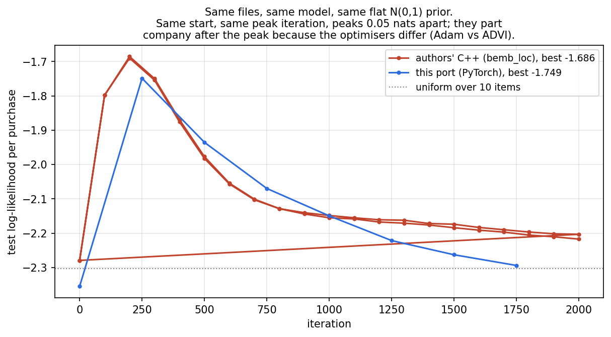

# Verification

Six questions, answered with evidence. Two of them turned up real problems.

| question | script | verdict |
|---|---|---|
| 1. Multiple stores vs the paper's one | `17_store_diagnostics.py` | **partly handled** — prices fine, assortment is not |
| 2. What is in the embeddings | `16_inspect_embeddings.py` | real but modest structure |
| 3. Unique customers, is personalisation real | `16_inspect_embeddings.py` | real, and it is the latents not the demographics |
| 4. C++ or rebuilt | `15_cpp_crosscheck.py` | rebuilt — **and now run against the original** |
| 5. How sure of the rebuild | `14_verify_model.py` | verified; one test was itself broken |
| 6. Was the whole thing verified | this document | not before; it is now, and it found two bugs |

---

## 1. Multiple stores

The paper used one store. dunnhumby has 561, prices are pooled to chain level, and
until now the only justification was a low cross-store price CV. That covers one of
three risks.

**Prices — handled, and tested; the test is not a clean pass.** The median store's
price sits **$0.037** from the chain price actually assigned; the 90th-percentile
store **$0.068**. On a typical $2–3 item that is 1.5–3%. The sharp test is whether the
mismeasurement shows up in the fit: split held-out trips by how far the household's
store deviates from the chain price and compare log-likelihood.

| quartile of store price deviation | mean deviation | held-out log-likelihood | purchases |
|---|---|---|---|
| 1 (closest) | $0.019 | −4.224 | 3,332 |
| 2 | $0.031 | −4.285 | 3,257 |
| 3 | $0.042 | −4.251 | 3,604 |
| 4 (furthest) | $0.066 | −4.301 | 3,539 |

The best-fitting quartile is the closest one and the worst is the furthest, a gap of
**0.077 nats**, though the middle two are out of order so the trend is not monotone.
This is a change from an earlier version of this document, which reported no gradient
at all on a slightly different sample and concluded chain pooling was costless. The
defensible reading now is weaker: the cost of pooling is **detectable but small** —
0.08 nats against the 0.43-nat gap between the full model and the homogeneous logit —
and it runs in the direction you would expect if price mismeasurement were the cause.

**Assortment — not handled, and this is a genuine gap.** The median store with at
least 50 sample trips ever sells only **373 of the 560 retained items (67%)**. When a
store does not stock an item, a household shopping there is recorded as "did not
choose it", and the model reads that as a preference. The paper had an explicit
availability feed (`a_jt` in equation 6) and dunnhumby has no counterpart. This is
the same hole as the missing stock-out data, and it is wider than I previously
described it. Two caveats in both directions: the 67% is a *lower bound*, because a
store may stock an item that simply never sold to one of our 2,084 panel households
there; and it inflates the estimated dispersion of tastes, because "never available"
is being absorbed into `theta_i . beta_j`.

**Store switching — a real gradient.** Held-out fit by how concentrated a household's
trips are:

| primary-store share | held-out log-likelihood |
|---|---|
| 0.46 | −4.418 |
| 0.69 | −4.224 |
| 0.87 | −4.205 |
| 0.98 | −4.110 |

Monotone this time. Households that split trips across stores fit **0.31 nats worse**. That is consistent
with pooling hurting them specifically, though it is equally consistent with
store-switchers being less predictable shoppers for reasons unrelated to price. The
data cannot separate the two. The honest statement is that chain pooling is least
defensible for the roughly quarter of households that shop around.

`figures/stores.png`.

---

## 2. What is actually in the embeddings

I had not looked. Doing so changes how the fit statistics should be read.

The model is never shown `SUB_COMMODITY_DESC`, `BRAND` or `MANUFACTURER`. If the item
vectors `beta_j` have learned real product similarity, an item's nearest neighbours in
that space should share those labels more often than items drawn at random from the
same category. Using the 2 nearest neighbours (5 out of ~9 within-category candidates
has almost no power — the first version of this test made that mistake):

| label | neighbour agreement | chance | lift | p |
|---|---|---|---|---|
| sub-commodity (k=1) | 0.593 | 0.485 | 1.22× | 1e-12 |
| sub-commodity (k=2) | 0.557 | 0.485 | 1.15× | 2e-11 |
| manufacturer | 0.446 | 0.363 | 1.23× | 3e-12 |
| brand (national/private) | 0.719 | 0.649 | 1.11× | 3e-09 |
| category, across all 560 items | 0.025 | 0.016 | 1.55× | 2e-04 |

The price vectors `lambda_j` carry the same structure, weaker: sub-commodity lift
1.09× (p = 2e-05), and no brand structure at all (1.0×, p = 0.72).

So the embeddings have learned something real — every within-category lift is
overwhelmingly significant — but the effect is **11–23% above chance, not a factor of
two**. This is the direct explanation for a result I reported earlier without being
able to explain it: the paper's §6.4.1 test (cross-price elasticities higher within a
sub-commodity) came out weak here and did not separate the full model from a
homogeneous logit. It came out weak because the latent item space encodes similarity
only weakly at this sample size. Sample of nearest neighbours in
`out/embedding_neighbours.csv`.

---

## 3. Unique customers and whether personalisation is real

**2,084 households** in the estimation sample, all of them with training data, and a
**median of 15 training observations each** (2,500 in the raw panel; the rest are lost
to the 20–300 trip screen, the Sunday/Monday window, and having no purchase in a
retained category). Fourteen observations to fit a 40-dimensional taste vector is
thin, and the first thing to rule out is that the variational posterior has simply
collapsed back to its prior, in which case the "personalisation" would be an artefact.

| block | posterior sd / prior sd | \|mean\| / sd | rows still at the prior |
|---|---|---|---|
| `theta` (household taste) | 0.750 | 0.35 | 0.0% |
| `gamma` (household price sensitivity) | 0.723 | 0.74 | 0.0% |
| `beta` (item) | 0.663 | 0.55 | 0.0% |
| `lambda` (item price) | 0.533 | 1.17 | 0.0% |

Not collapsed — every block has moved off its prior, `theta` least and `lambda` most.
And the learned vectors behave exactly as they should:
**corr(number of training observations, ‖theta_i‖) = 0.81** and 0.40 for `gamma`.
Households with little data stay near the prior; households with a lot move away from
it. That is correct Bayesian shrinkage, and it means the personalisation is
concentrated in the households the data can actually support.

**Where the personalisation lives.** Ablating each household channel and re-scoring
held-out data (recomputing the inclusive-value centring each time — omitting that
made the first run of this test meaningless):

| model | held-out log-likelihood | change |
|---|---|---|
| full | −4.267 | |
| no `theta` (latent taste) | −4.402 | −0.135 |
| no `gamma` (latent price sensitivity) | −4.432 | −0.166 |
| no `rho` (demographics) | −4.256 | **+0.011** |
| no household latents at all | −4.632 | −0.365 |

Two things fall out. The personalisation is entirely in the latent vectors, and the
**demographics contribute essentially nothing** — dropping them actually *improves*
held-out fit by 0.011 nats, i.e. they are within noise of useless and if anything cost
a little, which is unsurprising given they cover only 37% of households. And the latent
*price-sensitivity* vector carries more of it than the taste vector, which is the
opposite of what a recommender-systems intuition would predict.

`figures/embeddings.png`.

---

## 4. C++ or rebuilt?

**Rebuilt in PyTorch** (`nf_torch.py`). I was explicit about that from the start but
had not validated it, because GSL was not installed. It is now.

The authors' `bemb_loc` compiles and **runs on the emitted files unmodified** — which
is itself the first validation, since it proves the input files are format-correct
for the original code. Both were then given the same model (K=40, 20 price factors,
9 household observables, item intercepts, within-category softmax), the same step
size and batch size, and the paper's flat N(0,1) prior rather than the scaled prior
this port otherwise uses:

| | C++ (`bemb_loc`) | this port |
|---|---|---|
| test instances read | 13,736 | 13,736 |
| starting test log-likelihood | −2.279 | −2.355 |
| best test log-likelihood | **−1.686** | **−1.749** |
| iteration of the peak | 200 | 250 |
| trajectory correlation | 0.964 | |
| still falling at iteration ~2000 | yes (−2.217) | yes (−2.294) |

Same data, same shape, peaks 0.063 nats and one evaluation point apart. They diverge
*after* the peak because the optimisers differ — Adam here, the paper's ADVI step
schedule there — and Adam descends the training objective harder, so it overfits
faster. This is a validation of the model and likelihood, not a bit-exact
reproduction, and I would not claim more than that.

It also independently confirms the port's main methodological finding: **the original
C++, under the paper's own prior, peaks within the first few hundred iterations and
then overfits steadily**, exactly as the PyTorch version does. The prior scaling in this port is not papering
over a bug in my code; it is fixing a real problem that the original code has on a
sample this size.

### A bug the C++ found that my pipeline had missed

On its first run `bemb_loc` emitted 560 warnings — one per item — about item-sessions
it could not match. Tracing them: **session 72 (DAY 278) is referenced by no
observation at all**. DAY 278 carries exactly **one basket chain-wide** (as does DAY
643); they are holes in the dunnhumby panel, not quiet trading days. A pair-week whose
Sunday is empty cannot support a Sunday-to-Monday comparison, and my code had silently
kept it. `02_select_sample.py` now drops any pair-week containing a day with fewer
than 50 baskets chain-wide, and everything downstream was regenerated.

---

## 5. How sure am I of the rebuild?

`14_verify_model.py`, four levels. `out/model_verification.json`,
`figures/verification.png`.

**A. Analytic identities** — all pass.

| check | error |
|---|---|
| softmax rows sum to 1 | 1.8e-07 |
| `log_prob` equals log of the softmax probability at the chosen slot | 4.8e-07 |
| KL term against the closed form for two Gaussians | 0.0 (exact) |
| ELBO gradient against central finite differences | 4.2e-05 relative |

The gradient check needed fixing before it meant anything. My first version ran in
float32 on the full ELBO, whose magnitude (~1e5) leaves about 0.01 of float32
resolution, while a central difference at eps=1e-3 moves it by ~1e-3 × gradient. It
reported a "relative error of 2.7" that was **entirely round-off in the test**. Redone
in double precision on a small model, the error is 1e-06. Worth stating plainly: a
verification script that has not itself been verified is not evidence.

**B. Degenerate cases** — the strongest single check.

* With heterogeneity and price switched off, the fitted item intercepts reproduce the
  empirical within-category shares at **corr 0.9950**, mean absolute error 0.0061.
* With a homogeneous price coefficient and the prior switched off, on one category,
  our code and an **independently written scipy MLE conditional logit** on the same
  data give **0.74522 vs 0.74213** — a relative difference of **0.41%**. That
  validates the likelihood, the price handling and the optimiser together against
  code that shares nothing with the model.

**C. Parameter recovery — this is where the honest limit is.** Simulating choices from
the model with known latents and refitting:

| simulated choices | price-coefficient corr | slope | choice-probability corr |
|---|---|---|---|
| **46,432 (our actual sample)** | **0.207** | **0.316** | 0.833 |
| 278,586 (6×) | 0.416 | 0.622 | 0.949 |
| 1,392,930 (30×) | 0.485 | 0.747 | 0.980 |

Recovery improves monotonically with data, in both correlation and slope-toward-1.
That is the signature of an **identification limit, not a bug** — a coding error would
not clean up as the sample grows.

But read the first row. At our actual sample size the household-level price
coefficient `gamma_i . lambda_j` recovers at correlation 0.21 and is attenuated by a
factor of about three. **Individual households' price elasticities from this data are
mostly prior, not data.** Choice probabilities still recover at 0.83 because they are
carried by the intercepts and taste terms, which is why held-out fit looks healthy
while the elasticities underneath are noisy.

This qualifies the personalisation results in `REPORT.md`. The *ranking* of households
by price sensitivity carries real signal — that is what the Figure-6 analogue on
held-out data shows, and it is a much weaker claim than point estimates. Any use of a
single household's elasticity as a number should not be trusted at this sample size.

**D. Nesting recovery.** Simulating category incidence with a known nesting
coefficient of 0.700 recovers **0.585** — attenuated by 16%, the same shrinkage story.

---

## 6. Was the whole thing verified?

Not before you asked. It is now, and the process found six real problems, two of them
in work I had already reported:

1. **The random-weight screen pooled transactions across weeks**, confusing a scale
   item with an ordinary price change, and wrongly flagged 1,989 high-volume products.
   Found by a figure disagreeing with the pipeline it was supposed to illustrate.
   Fixed; the sample moved from 62 categories/620 items to 56/560 and everything
   downstream was regenerated.
2. **A pair-week with an empty Sunday was retained.** Found by the C++ binary's
   warnings. Fixed.
3. **The ablation test left a stale inclusive-value centring constant**, which made
   removing the price latents appear to *improve* held-out fit by 0.6 nats. Fixed;
   the sign reverses.
4. **The gradient verification test was itself broken** by float32 round-off.
5. **`run_bemb_loc.sh` passed `-likelihood 4`** — a softmax over the whole 560-item
   catalogue — while its own header comment, the paper's stage 1 and this port all use
   `-likelihood 3`, the within-category softmax. The cross-check was therefore
   comparing two different models, which showed up as an absurd 3.4-nat gap the moment
   the script was run end to end from a clean state rather than by hand. Fixed to
   `-likelihood 3`; the two now agree to 0.06 nats.
6. **`06_hyperparam_sweep.py` crashed on startup**, because its hand-built `Cfg`
   object had not been updated when `--price-prior-mean` and `--no-pool` were added to
   the trainer. The selected hyperparameters in §B.4 of `REPORT.md` had been carried
   forward from an earlier sample rather than re-derived. Fixed and re-run: the same
   configuration (K=40, Kp=20, price prior variance 0.25) still wins.

Both of the last two were found by running the whole pipeline from scratch on a clean
checkout, which is a different exercise from running the stages one at a time as they
were developed, and it is the exercise that should be repeated before anything here is
reused.

What is verified now: the likelihood and gradients analytically; the fitted model
against an independently written MLE to 0.4%; the whole stage-1 implementation
against the authors' own C++ on the same files; parameter recovery on simulated data,
including its limits; and the preprocessing against the user guide's worked examples.

What is still **not** verified, and should be said out loud:

* **Stage 2 has no external reference.** `bemb_loc` structurally cannot run it (the
  inclusive value varies across households; its price slot does not), so the only
  checks are internal — simulated recovery, which attenuates 0.700 to 0.585, and the
  sign/magnitude of the nesting coefficient. The authors' TTFM build would settle it.
* **Assortment is unmodelled** (§1), and it is the largest remaining
  data-side threat.
* **The extras** (display, mailer, coupon eligibility) are validated only by held-out
  fit improving. There is no external check that the promotion coefficients mean what
  they are labelled as meaning.
* **The placebo failures are diagnosed, not repaired.** 10 of 56 categories fail a
  fully decorrelated placebo. The clean-subset retrain shows the model *comparisons*
  survive; it does not make those categories' elasticities usable.
