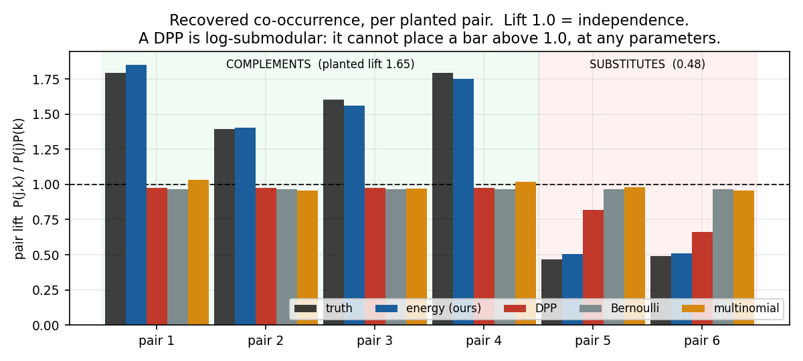
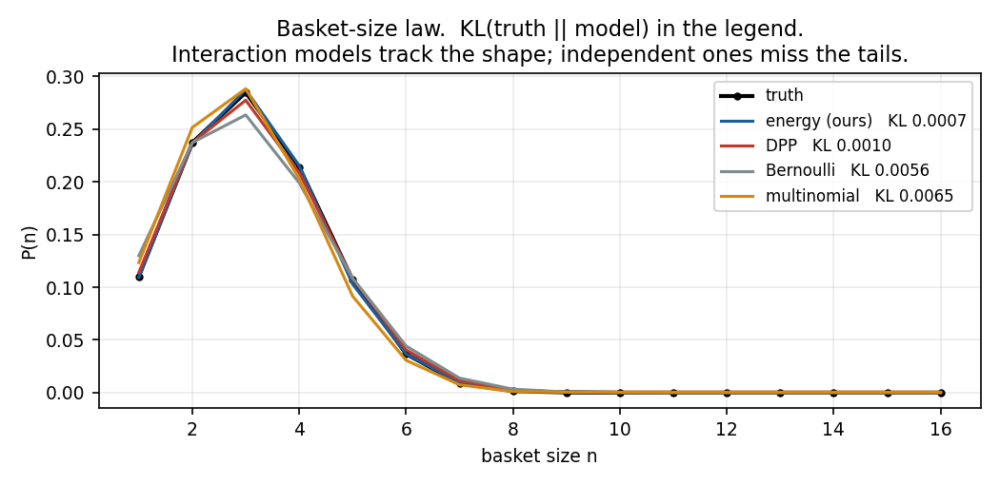
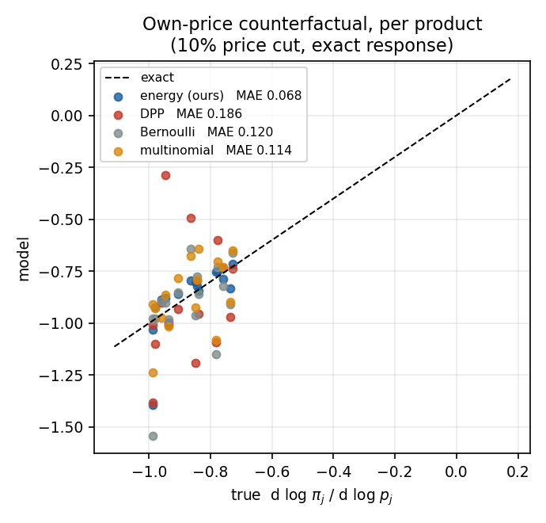
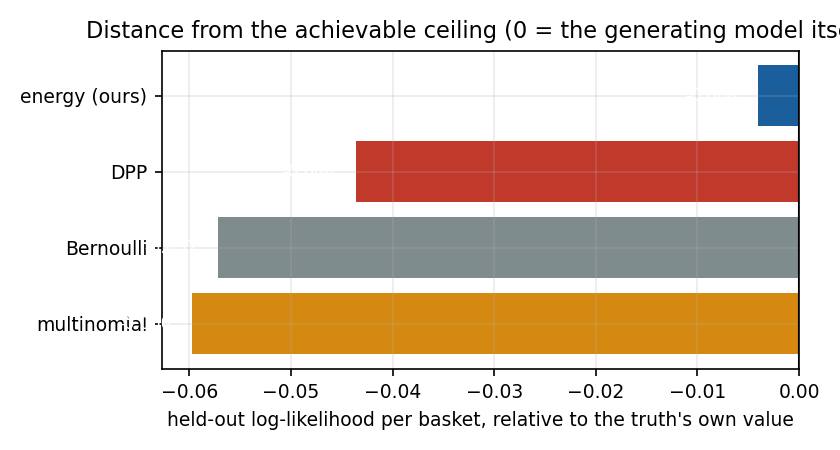

# Model arena: four classes, known ground truth

**2026-08-16** · `scripts/synth/s23_arena.py` · results `out/v3_arena.json`

## Why a synthetic environment

On dunnhumby nothing can be checked against truth. Observed pair lift confounds preference
with availability. The correct counterfactual response to a price change is unknown — there is
no experiment in the data. And `log Z` must be estimated, so any score mixes a model's *class*
with its *estimator*.

Here J = 16, so all 2^16 = 65,536 subsets enumerate. `P(S)`, every marginal, every pair
lift and the exact price response are closed-form. **Every model is fitted by exact maximum
likelihood** — no importance sampling, no variational bound, no ordering average. Differences
are therefore differences of model class alone.

### The generating process

```
E(S) = Σ_j b_j(price) + Σ_{j<k ∈ S} φ_j·φ_k − ρ₀(|S|)

  4 complementary pairs at φ'φ = +0.92   → planted lift 1.647
  2 substitutable pairs at φ'φ = −0.92   → planted lift 0.478
  b_j = a_j − β_j·Δlog p_j,  β_j > 0     so price counterfactuals are well posed
  ρ₀ quadratic                            giving an overdispersed size law
```

**This is our model's own functional form, which favours it on likelihood by construction.**
That is stated rather than hidden, and it is exactly why the other three axes carry the weight:
a DPP is not merely a worse *fit* here, it is structurally unable to represent positive
correlation at any parameter setting, and the co-occurrence panel demonstrates that directly
rather than inferring it from a likelihood gap.

Note the planted complement lift is **1.65, not exp(0.92) = 2.5**. At J=16 with mean
basket size ≈ 5, products are far from dilute (π ≈ 0.3), and lift reaches only ~56% of
`exp(φ'φ)` in that regime. The arena therefore tests whether a class can recover *a*
complementary structure, not grocery's specific strength.

### Entrants

| model | form | interaction |
|---|---|---|
| **energy** (ours) | `P(S) ∝ exp(Σb + Σφ_j·φ_k − ρ₀(n))` | signed, both directions |
| **DPP** | `P(S) ∝ det(L_S)`, `L = diag(d) + VV'` | log-submodular — repulsion only |
| **Bernoulli** | independent items | none |
| **multinomial** | size law × independent draws | none (size only) |

**Shopper is excluded, deliberately.** Its set probability requires a sum over `n!` orderings —
at J=16 that is ~2×10¹³ terms — so it could only be estimated while every other entrant is
exact. A comparison in which one model alone carries Monte Carlo bias measures the estimator,
not the model. Shopper is compared on real data instead, where all models are estimated alike
(see below).

## Results

| model | held-out ll | gap to ceiling | complement lift | substitute lift | size-law KL | own-price MAE |
|---|---|---|---|---|---|---|
| **truth** (ceiling) | -7.1768 | 0.000 | 1.647 | 0.478 | 0.0000 | — |
| energy (ours) | -7.1808 | -0.004 | 1.642 | 0.508 | 0.0007 | 0.068 |
| DPP | -7.2204 | -0.044 | 0.977 | 0.740 | 0.0010 | 0.186 |
| Bernoulli | -7.2340 | -0.057 | 0.969 | 0.969 | 0.0056 | 0.120 |
| multinomial | -7.2365 | -0.060 | 0.994 | 0.968 | 0.0065 | 0.114 |

`gap to ceiling` is the held-out log-likelihood relative to the **generating model's own**
value — the entropy floor no model can beat. `own-price MAE` is the mean absolute error in
`d log π_j / d log p_j` across all 16 products under a 10% price cut, against the exact response.

## 1. Co-occurrence — the structural result



**The DPP cannot place a bar above 1.0.** Its mean complement lift is **0.977** against a
planted 1.647, and this is not a fitting failure — `det(L_S)` is log-submodular, so the model
class assigns *negative* dependence by construction. No amount of training, capacity or
inference changes it.

The same panel shows the asymmetry that makes this diagnostic rather than merely negative: on
the **substitute** pairs the DPP reaches 0.740 against a true 0.478, genuinely capturing the
direction. It is not a bad model — it is a model of the wrong sign for grocery baskets, where
attraction dominates.

Our energy model recovers **1.642 against 1.647 (99.7%)** on complements and 0.508 against
0.478 on substitutes, with a single signed parameter `φ_j·φ_k` spanning both regimes.

Bernoulli and multinomial sit at ~1.0 on both, as models with no interaction term must.

## 2. Basket-size law



Both interaction models track the shape (KL 0.0007 and 0.0010); the
independent ones are 8–9× worse (0.0056, 0.0065) despite the
multinomial having an explicit free size law. That is the point of the panel: **a correct
size law is not enough** — the multinomial gets `P(n)` as a free parameter vector and still
loses, because with items drawn independently within a size the joint is wrong.

## 3. Price counterfactual



Per-product own-price response against the exact value, with the identity line. Our model's
MAE is **0.068**, against 0.186 for the DPP —
**2.7× better**. This matters more than likelihood for the intended use: a model used to choose
markdowns must get the response *per product* right, and an aggregate elasticity can be correct
while individual products are wrong in both magnitude and sign.

The DPP's error is systematic rather than noisy — repulsion between items distorts how a price
cut on one product propagates to the rest of the basket.

## 4. Distance from the achievable ceiling



Our model lands **-0.004 nats** from the generating model itself.
The DPP is 11× further out, and the
independent models further still — but read this panel last and with the caveat above: the
truth is our functional form, so this axis is the least informative of the four.

## Real-data comparison, for contrast

The arena isolates model class. On dunnhumby every model is estimated, so the comparison is of
class *and* inference together. All figures below are held-out log-likelihood per basket,
sampled across all weeks of each split, models trained to convergence (60,000 iterations):

| model | validation | test |
|---|---|---|
| **ours** (run39) | −29.226 | **−26.017** |
| Shopper | −48.310 | −45.757 |
| multinomial | −49.852 | −47.398 |
| non-symmetric DPP | −52.884 | −49.687 |

Shopper's ordering ladder converged (−48.297 at 8 orderings → −47.973 at 8,192, flat to 0.02
nats), so its figure is a real value rather than a lower bound. It is a **MAP reimplementation
of Shopper's likelihood structure**, not the published variational model.

The DPP scoring below an independent Bernoulli on real data (−46.32 against −45.07 in the
earlier run) is the same structural fact the arena isolates: forcing a repulsive model onto
attractive data costs more than assuming independence.

## What this does and does not establish

**Establishes.** The energy formulation recovers complementarity and substitution
simultaneously, to within 0.3% of planted strength, while matching the size law and the
per-product price response — and determinantal models cannot, by construction, whatever their
inference.

**Does not establish.** That our model fits *grocery* well. The arena's truth is our own
functional form; the real-data co-occurrence ratio is currently **0.092 against the 1.000 the
data shows**, and 166 of the 200 most common real pairs are never generated. The arena shows
the model class is capable of what the task needs. It does not show the fitted model achieves
it at 5,455 products, where `log Z` must be estimated and every failure this project has
diagnosed lives.
